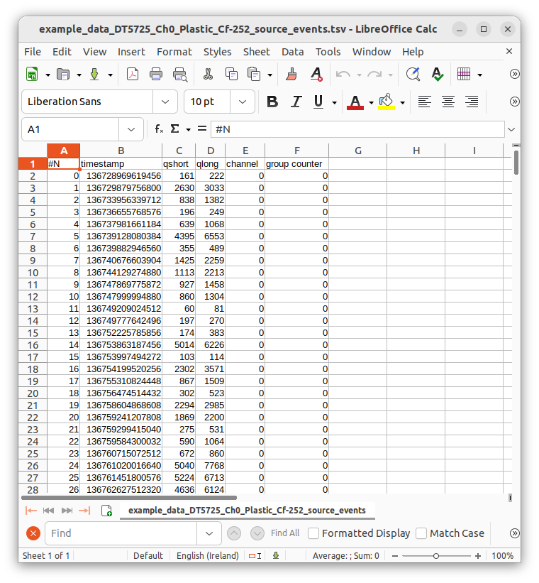
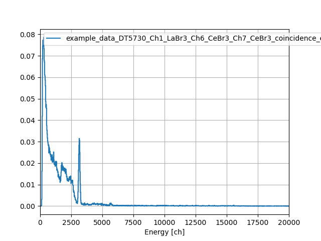
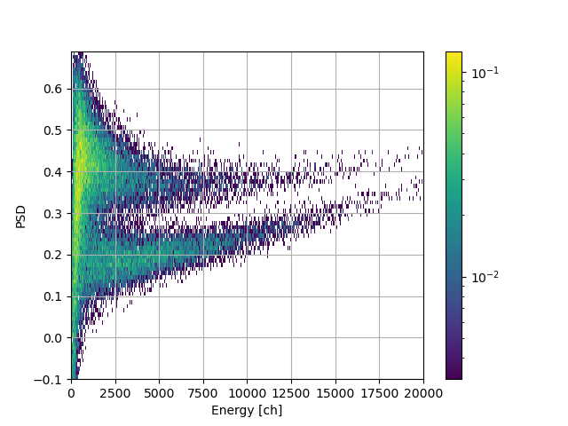

.. _ch-analyzing-offline:

============================
Analysis of saved data files
============================

In the previous step we replayed some example data and went through the user interface.
In this second step we will analyze together some example datafiles.

If ABCD was correctly installed (see :numref:`installation`) we can use some example datafiles that are in the ``data/`` folder.
If you followed the first part of the tutorial you should have saved some files along the way and could work on those.

Conversion of events files to ASCII
-----------------------------------

Some users prefer to start using their own analysis software to give a look at data and might prefer to start from ASCII data files.
There are some programs that can convert from events files to ASCII text files.
Refer to :numref:`sec-files-conversion` for more information about the options for converting files.

Go to the ``data/`` directory in the main ABCD directory to see the available example files::

    user-tutorial@abcd-tutorial:~/abcd/data$ cd ~/abcd/data/
    user-tutorial@abcd-tutorial:~/abcd/data$ ls
    example_data_DT5725_Ch0_Plastic_Cf-252_source_events.ade                 
    example_data_DT5730_Ch1_LaBr3_Ch6_CeBr3_Ch7_CeBr3_coincidence_events.ade 
    example_data_DT5730_Ch1_LaBr3_Ch6_CeBr3_Ch7_CeBr3_coincidence_raw.adr.bz2
    example_data_DT5730_Ch2_LaBr3_Ch4_LYSO_Ch6_YAP_events.ade
    example_data_DT5730_Ch2_LaBr3_Ch4_LYSO_Ch6_YAP_raw.adr.bz2
    example_data_DT5730_Ch2_LaBr3_Ch4_LYSO_Ch6_YAP_waveforms.adw.bz2

From this directory we can use one of the conversion programs.
They all come with an in-line help that we can call with the ``-h`` option::

    user-tutorial@abcd-tutorial:~/abcd/data$ ../convert/ade2ascii.py -h
    usage: ade2ascii.py [-h] [-o OUTPUT_NAME] file_name

    Read and print an ABCD events file converting it to ASCII

    positional arguments:
      file_name             Name of the input file

    options:
      -h, --help            show this help message and exit
      -o OUTPUT_NAME, --output_name OUTPUT_NAME
                            Write to a file instead of the stdout

The program will by default print to the `stdout <https://en.wikipedia.org/wiki/Standard_streams>`_, but we prefer to save the result to a file.
Thus we use the ``-o`` option::

    user-tutorial@abcd-tutorial:~/abcd/data$ ../convert/ade2ascii.py -o example_data_DT5725_Ch0_Plastic_Cf-252_source_events.tsv example_data_DT5725_Ch0_Plastic_Cf-252_source_events.ade 

The result is a `Tab-Separated Values file <https://en.wikipedia.org/wiki/Tab-separated_values>`_ that is a variation of the `Comma-separated_values format <https://en.wikipedia.org/wiki/Comma-separated_values>`_.
This TSV file is just an ASCII file in which columns are separated by tabs.
We can check the resulting file using some standard unix tools::

    user-tutorial@abcd-tutorial:~/abcd/data$ ls -lh example_data_DT5725_Ch0_Plastic_Cf-252_source_events.*
    -rw-rw-r-- 1 user-tutorial user-tutorial 1.5M Aug  5 15:57 example_data_DT5725_Ch0_Plastic_Cf-252_source_events.ade
    -rw-rw-r-- 1 user-tutorial user-tutorial 3.1M Aug  5 16:09 example_data_DT5725_Ch0_Plastic_Cf-252_source_events.tsv
    user-tutorial@abcd-tutorial:~/abcd/data$ head example_data_DT5725_Ch0_Plastic_Cf-252_source_events.tsv 
    #N	timestamp	qshort	qlong	channel	group counter
    0	136728969619456	161	222	0	0
    1	136729879756800	2630	3033	0	0
    2	136733956339712	838	1382	0	0
    3	136736655768576	196	249	0	0
    4	136737981661184	639	1068	0	0
    5	136739128080384	4395	6553	0	0
    6	136739882946560	355	489	0	0
    7	136740676603904	1425	2259	0	0
    8	136744129274880	1113	2213	0	0

    Screenshot of LibreOffice Calc showing an events file of ABCD converted to ASCII.

Common spreadsheet software can easily open this file format (see :numref:`fig-tutorial-screenshot-libreoffice`).

.. note::
    Events files do not directly contain the energy spectra, they are so called *list mode files* (*i.e.* files that contain all the events in the recording order).
    In order to generate spectra we need to analyze the events files with the available python scripts.

Plotting energy spectra
-----------------------

We can now plot the energy spectra associated with one of these files.
Use the script::

    user-tutorial@abcd-tutorial:~/abcd/data$ ../bin/plot_spectra.py -h
    usage: plot_spectra.py [-h] [-n NS_PER_SAMPLE] [-w SMOOTH_WINDOW] [-R ENERGY_RESOLUTION] [-e ENERGY_MIN] [-E ENERGY_MAX] [-B BUFFER_SIZE] [-d] [-s] [--save_plot] [--images_extension IMAGES_EXTENSION]
                           file_names [file_names ...] channel

    Plots multiple time normalized spectra from ABCD events data files.

    positional arguments:
      file_names            List of space-separated file names
      channel               Channel selection (all or number)

    options:
      -h, --help            show this help message and exit
      -n NS_PER_SAMPLE, --ns_per_sample NS_PER_SAMPLE
                            Nanoseconds per sample (default: 0.001953)
      -w SMOOTH_WINDOW, --smooth_window SMOOTH_WINDOW
                            Smooth window (default: 1.000000)
      -R ENERGY_RESOLUTION, --energy_resolution ENERGY_RESOLUTION
                            Energy resolution (default: 20.000000)
      -e ENERGY_MIN, --energy_min ENERGY_MIN
                            Energy min (default: 0.000000)
      -E ENERGY_MAX, --energy_max ENERGY_MAX
                            Energy max (default: 20000.000000)
      -B BUFFER_SIZE, --buffer_size BUFFER_SIZE
                            Buffer size for file reading (default: 167772160.000000)
      -d, --enable_derivatives
                            Enable spectra derivatives calculation
      -s, --save_data       Save histograms to file
      --save_plot           Save plot to file
      --images_extension IMAGES_EXTENSION
                            Define the extension of the image files (default: pdf)

As usual it has a handy in-line help.
This script calculates the energy spectra of events files with the given parameters and the selected channel.
It is able to plot the result to an image, but also to save the result to a CSV file that can be read by something else (like spreadsheet software).
First we plot the energy spectrum of a LaBr detector in channel 1::

    user-tutorial@abcd-tutorial:~/abcd/data$ ../bin/plot_spectra.py -E 20000 --save_plot --images_extension=png example_data_DT5730_Ch1_LaBr3_Ch6_CeBr3_Ch7_CeBr3_coincidence_events.ade 1
    Using buffer size: 167772160
    Reading: example_data_DT5730_Ch1_LaBr3_Ch6_CeBr3_Ch7_CeBr3_coincidence_events.ade
        Reading chunk: 0
        Reading chunk: 1
        ERROR: min() arg is an empty sequence
        Total number of events of channel 1: 71167
        Number of events in energy range: 70285
        Time delta: 19863.900843 s
        Average rate total: 3.582730 Hz
        Average rate in range: 3.538328 Hz
    Saving figure to: example_data_DT5730_Ch1_LaBr3_Ch6_CeBr3_Ch7_CeBr3_coincidence_events_ch1.png

    Spectrum of the example data available in ABCD. It is the background spectrum of a LaBr detector.

:numref:`fig-tutorial-example-spectrum` shows the resulting image generated by the script.
We can now save the resulting spectrum to a CSV file::

    user-tutorial@abcd-tutorial:~/abcd/data$ ../bin/plot_spectra.py -E 20000 -s example_data_DT5730_Ch1_LaBr3_Ch6_CeBr3_Ch7_CeBr3_coincidence_events.ade 1
    Using buffer size: 167772160
    Reading: example_data_DT5730_Ch1_LaBr3_Ch6_CeBr3_Ch7_CeBr3_coincidence_events.ade
        Reading chunk: 0
        Reading chunk: 1
        ERROR: min() arg is an empty sequence
        Total number of events of channel 1: 71167
        Number of events in energy range: 70285
        Time delta: 19863.900843 s
        Average rate total: 3.582730 Hz
        Average rate in range: 3.538328 Hz
        Writing qlong histogram to: example_data_DT5730_Ch1_LaBr3_Ch6_CeBr3_Ch7_CeBr3_coincidence_events_ch1_energy.csv
    user-tutorial@abcd-tutorial:~/abcd/data$ head -n 20 example_data_DT5730_Ch1_LaBr3_Ch6_CeBr3_Ch7_CeBr3_coincidence_events_ch1_energy.csv 
    # #energy,counts
    0.000000000000000000e+00,0.000000000000000000e+00
    2.000000000000000000e+01,0.000000000000000000e+00
    4.000000000000000000e+01,0.000000000000000000e+00
    6.000000000000000000e+01,0.000000000000000000e+00
    8.000000000000000000e+01,0.000000000000000000e+00
    1.000000000000000000e+02,4.027406330258181347e-04
    1.200000000000000000e+02,3.070897326821863359e-03
    1.400000000000000000e+02,1.636133821667386246e-02
    1.600000000000000000e+02,4.178434067642863153e-02
    1.800000000000000000e+02,6.866727793090199317e-02
    2.000000000000000000e+02,7.455735968890458976e-02
    2.200000000000000000e+02,7.727585896182885550e-02
    2.400000000000000000e+02,7.450701710977634951e-02
    2.600000000000000000e+02,7.727585896182885550e-02
    2.800000000000000000e+02,7.858476601916276894e-02
    3.000000000000000000e+02,7.324845263157067632e-02
    3.200000000000000000e+02,6.796248182310681007e-02
    3.400000000000000000e+02,6.710665797792694787e-02
    3.600000000000000000e+02,6.121657621992435822e-02

Plotting Pulse Shape Discrimination diagrams
--------------------------------------------

We can now move on to the Pulse Shape Discrimination (PSD) diagrams associated with one of these files.
Use the script::

    user-tutorial@abcd-tutorial:~/abcd/data$ ../bin/plot_PSD.py -h
    usage: plot_PSD.py [-h] [-t PSD_THRESHOLD] [-n NS_PER_SAMPLE] [-w SMOOTH_WINDOW] [-r PSD_RESOLUTION] [-p PSD_MIN] [-P PSD_MAX] [-R ENERGY_RESOLUTION] [-e ENERGY_MIN] [-E ENERGY_MAX] [-B BUFFER_SIZE] [-s]
                       [--polygon_file POLYGON_FILE]
                       file_names [file_names ...] channel

    Plots Pulse Shape Discrimination information from ABCD events data files.

    positional arguments:
      file_names            List of space-separated file names
      channel               Channel selection (all or number)

    options:
      -h, --help            show this help message and exit
      -t PSD_THRESHOLD, --PSD_threshold PSD_THRESHOLD
                            Simple PSD threshold for n/gamma discrimination (default: 0.170000)
      -n NS_PER_SAMPLE, --ns_per_sample NS_PER_SAMPLE
                            Nanoseconds per sample (default: 0.001953)
      -w SMOOTH_WINDOW, --smooth_window SMOOTH_WINDOW
                            Smooth window (default: 1.000000)
      -r PSD_RESOLUTION, --PSD_resolution PSD_RESOLUTION
                            PSD resolution (default: 0.010000)
      -p PSD_MIN, --PSD_min PSD_MIN
                            PSD min (default: -0.100000)
      -P PSD_MAX, --PSD_max PSD_MAX
                            PSD max (default: 0.700000)
      -R ENERGY_RESOLUTION, --energy_resolution ENERGY_RESOLUTION
                            Energy resolution (default: 20.000000)
      -e ENERGY_MIN, --energy_min ENERGY_MIN
                            Energy min (default: 0.000000)
      -E ENERGY_MAX, --energy_max ENERGY_MAX
                            Energy max (default: 20000.000000)
      -B BUFFER_SIZE, --buffer_size BUFFER_SIZE
                            Buffer size for file reading (default: 167772160.000000)
      -s, --save_data       Save histograms to file
      --polygon_file POLYGON_FILE
                            Filename with a polygon to be drawn on top of the plot

This script calculates the energy spectra and the PSD diagram of events files.
The PSD parameter is calculated according to:

.. math:: \text{PSD parameter} = \frac{Q_{\text{long}} - Q_{\text{short}}}{Q_{\text{long}}}
    :label: eq-tutorial2-PSD

Where :math:`Q_{\text{long}}` and :math:`Q_{\text{short}}` refer to the results of the two integration results over two intervals for the traditional double integration method for PSD.
:math:`Q_{\text{long}}` and :math:`Q_{\text{short}}` are the two ``Q`` entries in the processed events binary representation (see :numref:`sec-binary-protocol-events`).
Also this script is able to plot the result to an image, but also to save the result to a CSV file.
Plot the PSD diagram first::

    user-tutorial@abcd-tutorial:~/abcd/data$ ../bin/plot_PSD.py example_data_DT5725_Ch0_Plastic_Cf-252_source_events.ade 0
    Using buffer size: 167772160
    Reading: example_data_DT5725_Ch0_Plastic_Cf-252_source_events.ade
        Reading chunk: 0
    /home/fontana/abcd/data/../bin/plot_PSD.py:179: RuntimeWarning: divide by zero encountered in true_divide
      PSDs = (qlongs.astype(np.float64) - qshorts) / qlongs
        Reading chunk: 1
        ERROR: min() arg is an empty sequence
        Number of events: 91952
        Time delta: 317.095820 s
        Average rate: 289.981748 Hz

    Spectrum of the example data available in ABCD. It is the PSD diagram of a :sup:`252` Cf source detected with a plastic scintillation detector.

:numref:`fig-tutorial-example-psd` shows the resulting image of the bidimensional histogram PSD parameter vs energy.
The two data bananas represent the two populations of neutrons and gammas emitted by a :sup:`252` Cf source detected with a plastic scintillation detector.
We can now save the energy spectrum and PSD distribution to CSV files::

    user-tutorial@abcd-tutorial:~/abcd/data$ ../bin/plot_PSD.py -s example_data_DT5725_Ch0_Plastic_Cf-252_source_events.ade 0
    Using buffer size: 167772160
    Reading: example_data_DT5725_Ch0_Plastic_Cf-252_source_events.ade
        Reading chunk: 0
    /home/fontana/abcd/data/../bin/plot_PSD.py:179: RuntimeWarning: divide by zero encountered in true_divide
      PSDs = (qlongs.astype(np.float64) - qshorts) / qlongs
        Reading chunk: 1
        ERROR: min() arg is an empty sequence
        Number of events: 91952
        Time delta: 317.095820 s
        Average rate: 289.981748 Hz
        Writing qlong histogram to: example_data_DT5725_Ch0_Plastic_Cf-252_source_events_qlong.csv
        Writing PSD histogram to: example_data_DT5725_Ch0_Plastic_Cf-252_source_events_PSD.csv

