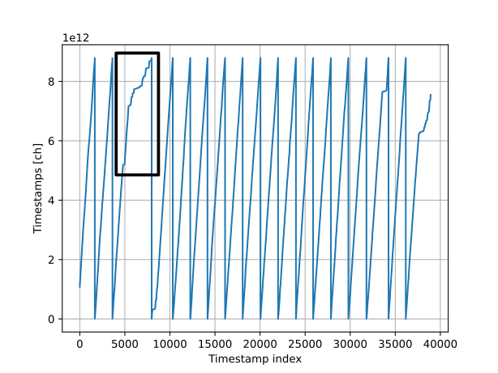
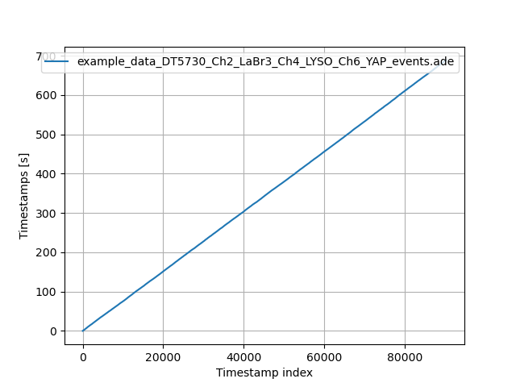
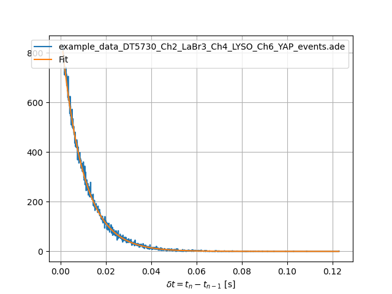
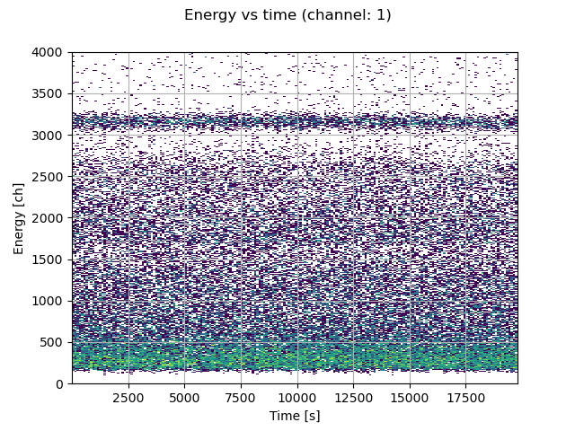
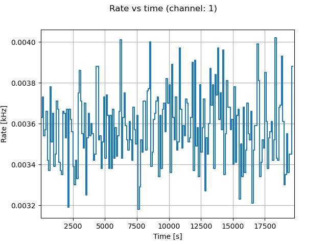
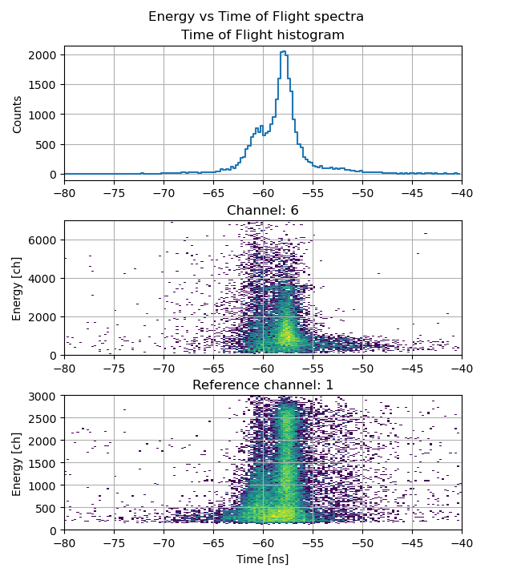
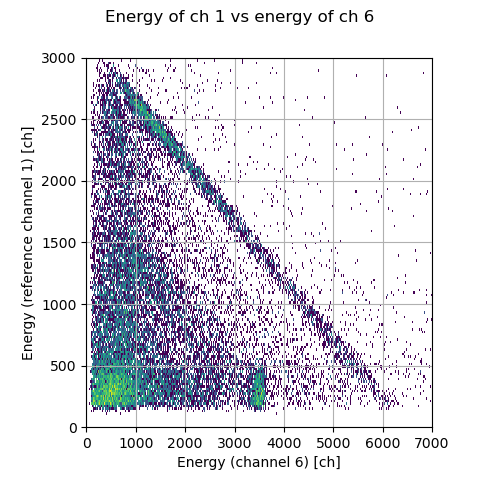
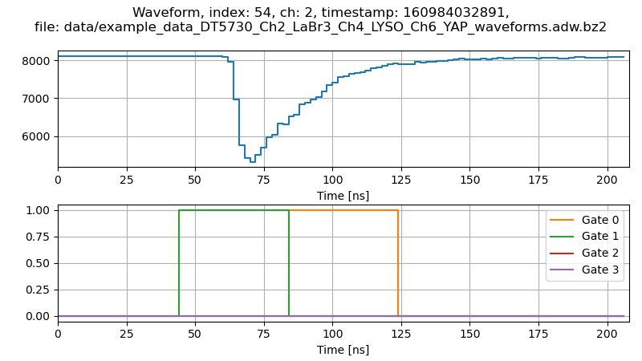
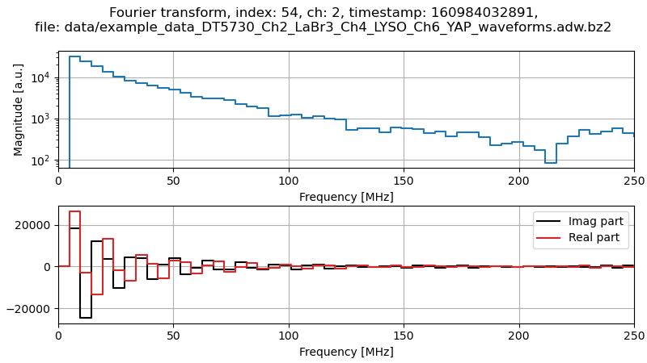

.. _ch-analyzing-offline:

============================
Analysis of saved data files
============================

In the previous step we replayed some example data and went through the user interface.
In this second step we will analyze together some example datafiles.

If ABCD was correctly installed (see :numref:`installation`) we can use some example datafiles that are in the ``data/`` folder.
If you followed the first part of the tutorial you should have saved some files along the way and could work on those.

Conversion of events files to ASCII
-----------------------------------

Some users prefer to start using their own analysis software to give a look at data and might prefer to start from ASCII data files.
There are some programs that can convert from events files to ASCII text files.
Refer to :numref:`sec-files-conversion` for more information about the options for converting files.

Go to the ``data/`` directory in the main ABCD directory to see the available example files::

    user-tutorial@abcd-tutorial:~/abcd/data$ cd ~/abcd/data/
    user-tutorial@abcd-tutorial:~/abcd/data$ ls
    example_data_DT5725_Ch0_Plastic_Cf-252_source_events.ade                 
    example_data_DT5730_Ch1_LaBr3_Ch6_CeBr3_Ch7_CeBr3_coincidence_events.ade 
    example_data_DT5730_Ch1_LaBr3_Ch6_CeBr3_Ch7_CeBr3_coincidence_raw.adr.bz2
    example_data_DT5730_Ch2_LaBr3_Ch4_LYSO_Ch6_YAP_events.ade
    example_data_DT5730_Ch2_LaBr3_Ch4_LYSO_Ch6_YAP_raw.adr.bz2
    example_data_DT5730_Ch2_LaBr3_Ch4_LYSO_Ch6_YAP_waveforms.adw.bz2

From this directory we can use one of the conversion programs.
They all come with an in-line help that we can call with the ``-h`` option::

    user-tutorial@abcd-tutorial:~/abcd/data$ ../convert/ade2ascii.py -h
    usage: ade2ascii.py [-h] [-o OUTPUT_NAME] file_name

    Read and print an ABCD events file converting it to ASCII

    positional arguments:
      file_name             Name of the input file

    options:
      -h, --help            show this help message and exit
      -o OUTPUT_NAME, --output_name OUTPUT_NAME
                            Write to a file instead of the stdout

The program will by default print to the `stdout <https://en.wikipedia.org/wiki/Standard_streams>`_, but we prefer to save the result to a file.
Thus we use the ``-o`` option::

    user-tutorial@abcd-tutorial:~/abcd/data$ ../convert/ade2ascii.py -o example_data_DT5725_Ch0_Plastic_Cf-252_source_events.tsv example_data_DT5725_Ch0_Plastic_Cf-252_source_events.ade 

The result is a `Tab-Separated Values file <https://en.wikipedia.org/wiki/Tab-separated_values>`_ that is a variation of the `Comma-separated_values format <https://en.wikipedia.org/wiki/Comma-separated_values>`_.
This TSV file is just an ASCII file in which columns are separated by tabs.
We can check the resulting file using some standard unix tools::

    user-tutorial@abcd-tutorial:~/abcd/data$ ls -lh example_data_DT5725_Ch0_Plastic_Cf-252_source_events.*
    -rw-rw-r-- 1 user-tutorial user-tutorial 1.5M Aug  5 15:57 example_data_DT5725_Ch0_Plastic_Cf-252_source_events.ade
    -rw-rw-r-- 1 user-tutorial user-tutorial 3.1M Aug  5 16:09 example_data_DT5725_Ch0_Plastic_Cf-252_source_events.tsv
    user-tutorial@abcd-tutorial:~/abcd/data$ head example_data_DT5725_Ch0_Plastic_Cf-252_source_events.tsv 
    #N	timestamp	qshort	qlong	channel	group counter
    0	136728969619456	161	222	0	0
    1	136729879756800	2630	3033	0	0
    2	136733956339712	838	1382	0	0
    3	136736655768576	196	249	0	0
    4	136737981661184	639	1068	0	0
    5	136739128080384	4395	6553	0	0
    6	136739882946560	355	489	0	0
    7	136740676603904	1425	2259	0	0
    8	136744129274880	1113	2213	0	0

.. figure:: images/Screenshot_LibreOffice.png
    :name: fig-tutorial-screenshot-libreoffice
    :width: 100%
    :alt: screenshot of LibreOffice Calc showing a converted events file of ABCD

    Screenshot of LibreOffice Calc showing an events file of ABCD converted to ASCII.

Common spreadsheet software can easily open this file format (see :numref:`fig-tutorial-screenshot-libreoffice`).

.. note::
    Events files do not directly contain the energy spectra, they are so called *list mode files* (*i.e.* files that contain all the events in the recording order).
    In order to generate spectra we need to analyze the events files with the available python scripts.

Plotting energy spectra
-----------------------

We can now plot the energy spectra associated with one of these files.
Use the script::

    user-tutorial@abcd-tutorial:~/abcd/data$ ../bin/plot_spectra.py -h
    usage: plot_spectra.py [-h] [-n NS_PER_SAMPLE] [-w SMOOTH_WINDOW] [-R ENERGY_RESOLUTION] [-e ENERGY_MIN] [-E ENERGY_MAX] [-B BUFFER_SIZE] [-d] [-s] [--save_plot] [--images_extension IMAGES_EXTENSION]
                           file_names [file_names ...] channel

    Plots multiple time normalized spectra from ABCD events data files.

    positional arguments:
      file_names            List of space-separated file names
      channel               Channel selection (all or number)

    options:
      -h, --help            show this help message and exit
      -n NS_PER_SAMPLE, --ns_per_sample NS_PER_SAMPLE
                            Nanoseconds per sample (default: 0.001953)
      -w SMOOTH_WINDOW, --smooth_window SMOOTH_WINDOW
                            Smooth window (default: 1.000000)
      -R ENERGY_RESOLUTION, --energy_resolution ENERGY_RESOLUTION
                            Energy resolution (default: 20.000000)
      -e ENERGY_MIN, --energy_min ENERGY_MIN
                            Energy min (default: 0.000000)
      -E ENERGY_MAX, --energy_max ENERGY_MAX
                            Energy max (default: 20000.000000)
      -B BUFFER_SIZE, --buffer_size BUFFER_SIZE
                            Buffer size for file reading (default: 167772160.000000)
      -d, --enable_derivatives
                            Enable spectra derivatives calculation
      -s, --save_data       Save histograms to file
      --save_plot           Save plot to file
      --images_extension IMAGES_EXTENSION
                            Define the extension of the image files (default: pdf)

As usual it has a handy in-line help.
This script calculates the energy spectra of events files with the given parameters and the selected channel.
It is able to plot the result to an image, but also to save the result to a CSV file that can be read by something else (like spreadsheet software).
First we plot the energy spectrum of a LaBr detector in channel 1::

    user-tutorial@abcd-tutorial:~/abcd/data$ ../bin/plot_spectra.py -E 20000 --save_plot --images_extension=png example_data_DT5730_Ch1_LaBr3_Ch6_CeBr3_Ch7_CeBr3_coincidence_events.ade 1
    Using buffer size: 167772160
    Reading: example_data_DT5730_Ch1_LaBr3_Ch6_CeBr3_Ch7_CeBr3_coincidence_events.ade
        Reading chunk: 0
        Reading chunk: 1
        ERROR: min() arg is an empty sequence
        Total number of events of channel 1: 71167
        Number of events in energy range: 70285
        Time delta: 19863.900843 s
        Average rate total: 3.582730 Hz
        Average rate in range: 3.538328 Hz
    Saving figure to: example_data_DT5730_Ch1_LaBr3_Ch6_CeBr3_Ch7_CeBr3_coincidence_events_ch1.png

.. figure:: images/example_data_DT5730_Ch1_LaBr3_Ch6_CeBr3_Ch7_CeBr3_coincidence_events_ch1.png
    :name: fig-tutorial-example-spectrum
    :width: 100%
    :alt: spectrum of example data of a LaBr detector available in ABCD

    Spectrum of the example data available in ABCD. It is the background spectrum of a LaBr detector.

:numref:`fig-tutorial-example-spectrum` shows the resulting image generated by the script.
We can now save the resulting spectrum to a CSV file::

    user-tutorial@abcd-tutorial:~/abcd/data$ ../bin/plot_spectra.py -E 20000 -s example_data_DT5730_Ch1_LaBr3_Ch6_CeBr3_Ch7_CeBr3_coincidence_events.ade 1
    Using buffer size: 167772160
    Reading: example_data_DT5730_Ch1_LaBr3_Ch6_CeBr3_Ch7_CeBr3_coincidence_events.ade
        Reading chunk: 0
        Reading chunk: 1
        ERROR: min() arg is an empty sequence
        Total number of events of channel 1: 71167
        Number of events in energy range: 70285
        Time delta: 19863.900843 s
        Average rate total: 3.582730 Hz
        Average rate in range: 3.538328 Hz
        Writing qlong histogram to: example_data_DT5730_Ch1_LaBr3_Ch6_CeBr3_Ch7_CeBr3_coincidence_events_ch1_energy.csv
    user-tutorial@abcd-tutorial:~/abcd/data$ head -n 20 example_data_DT5730_Ch1_LaBr3_Ch6_CeBr3_Ch7_CeBr3_coincidence_events_ch1_energy.csv 
    # #energy,counts
    0.000000000000000000e+00,0.000000000000000000e+00
    2.000000000000000000e+01,0.000000000000000000e+00
    4.000000000000000000e+01,0.000000000000000000e+00
    6.000000000000000000e+01,0.000000000000000000e+00
    8.000000000000000000e+01,0.000000000000000000e+00
    1.000000000000000000e+02,4.027406330258181347e-04
    1.200000000000000000e+02,3.070897326821863359e-03
    1.400000000000000000e+02,1.636133821667386246e-02
    1.600000000000000000e+02,4.178434067642863153e-02
    1.800000000000000000e+02,6.866727793090199317e-02
    2.000000000000000000e+02,7.455735968890458976e-02
    2.200000000000000000e+02,7.727585896182885550e-02
    2.400000000000000000e+02,7.450701710977634951e-02
    2.600000000000000000e+02,7.727585896182885550e-02
    2.800000000000000000e+02,7.858476601916276894e-02
    3.000000000000000000e+02,7.324845263157067632e-02
    3.200000000000000000e+02,6.796248182310681007e-02
    3.400000000000000000e+02,6.710665797792694787e-02
    3.600000000000000000e+02,6.121657621992435822e-02

Plotting Pulse Shape Discrimination diagrams
--------------------------------------------

We can now move on to the Pulse Shape Discrimination (PSD) diagrams associated with one of these files.
Use the script::

    user-tutorial@abcd-tutorial:~/abcd/data$ ../bin/plot_PSD.py -h
    usage: plot_PSD.py [-h] [-t PSD_THRESHOLD] [-n NS_PER_SAMPLE] [-w SMOOTH_WINDOW] [-r PSD_RESOLUTION] [-p PSD_MIN] [-P PSD_MAX] [-R ENERGY_RESOLUTION] [-e ENERGY_MIN] [-E ENERGY_MAX] [-B BUFFER_SIZE] [-s]
                       [--polygon_file POLYGON_FILE]
                       file_names [file_names ...] channel

    Plots Pulse Shape Discrimination information from ABCD events data files.

    positional arguments:
      file_names            List of space-separated file names
      channel               Channel selection (all or number)

    options:
      -h, --help            show this help message and exit
      -t PSD_THRESHOLD, --PSD_threshold PSD_THRESHOLD
                            Simple PSD threshold for n/gamma discrimination (default: 0.170000)
      -n NS_PER_SAMPLE, --ns_per_sample NS_PER_SAMPLE
                            Nanoseconds per sample (default: 0.001953)
      -w SMOOTH_WINDOW, --smooth_window SMOOTH_WINDOW
                            Smooth window (default: 1.000000)
      -r PSD_RESOLUTION, --PSD_resolution PSD_RESOLUTION
                            PSD resolution (default: 0.010000)
      -p PSD_MIN, --PSD_min PSD_MIN
                            PSD min (default: -0.100000)
      -P PSD_MAX, --PSD_max PSD_MAX
                            PSD max (default: 0.700000)
      -R ENERGY_RESOLUTION, --energy_resolution ENERGY_RESOLUTION
                            Energy resolution (default: 20.000000)
      -e ENERGY_MIN, --energy_min ENERGY_MIN
                            Energy min (default: 0.000000)
      -E ENERGY_MAX, --energy_max ENERGY_MAX
                            Energy max (default: 20000.000000)
      -B BUFFER_SIZE, --buffer_size BUFFER_SIZE
                            Buffer size for file reading (default: 167772160.000000)
      -s, --save_data       Save histograms to file
      --polygon_file POLYGON_FILE
                            Filename with a polygon to be drawn on top of the plot

This script calculates the energy spectra and the PSD diagram of events files.
The PSD parameter is calculated according to:

.. math:: \text{PSD parameter} = \frac{Q_{\text{long}} - Q_{\text{short}}}{Q_{\text{long}}}
    :label: eq-tutorial2-PSD

Where :math:`Q_{\text{long}}` and :math:`Q_{\text{short}}` refer to the results of the two integration results over two intervals for the traditional double integration method for PSD.
:math:`Q_{\text{long}}` and :math:`Q_{\text{short}}` are the two ``Q`` entries in the processed events binary representation (see :numref:`sec-binary-protocol-events`).
Also this script is able to plot the result to an image, but also to save the result to a CSV file.
Plot the PSD diagram first::

    user-tutorial@abcd-tutorial:~/abcd/data$ ../bin/plot_PSD.py example_data_DT5725_Ch0_Plastic_Cf-252_source_events.ade 0
    Using buffer size: 167772160
    Reading: example_data_DT5725_Ch0_Plastic_Cf-252_source_events.ade
        Reading chunk: 0
    /home/user-tutorial/abcd/data/../bin/plot_PSD.py:179: RuntimeWarning: divide by zero encountered in true_divide
      PSDs = (qlongs.astype(np.float64) - qshorts) / qlongs
        Reading chunk: 1
        ERROR: min() arg is an empty sequence
        Number of events: 91952
        Time delta: 317.095820 s
        Average rate: 289.981748 Hz

.. figure:: images/example_data_DT5725_Ch0_Plastic_Cf-252_source_events.png
    :name: fig-tutorial-example-psd
    :width: 100%
    :alt: psd of example data of a plastic detector available in ABCD

    Spectrum of the example data available in ABCD. It is the PSD diagram of a :sup:`252` Cf source detected with a plastic scintillation detector.

:numref:`fig-tutorial-example-psd` shows the resulting image of the bidimensional histogram PSD parameter vs energy.
The two data bananas represent the two populations of neutrons and gammas emitted by a :sup:`252` Cf source detected with a plastic scintillation detector.
We can now save the energy spectrum and PSD distribution to CSV files::

    user-tutorial@abcd-tutorial:~/abcd/data$ ../bin/plot_PSD.py -s example_data_DT5725_Ch0_Plastic_Cf-252_source_events.ade 0
    Using buffer size: 167772160
    Reading: example_data_DT5725_Ch0_Plastic_Cf-252_source_events.ade
        Reading chunk: 0
    /home/user-tutorial/abcd/data/../bin/plot_PSD.py:179: RuntimeWarning: divide by zero encountered in true_divide
      PSDs = (qlongs.astype(np.float64) - qshorts) / qlongs
        Reading chunk: 1
        ERROR: min() arg is an empty sequence
        Number of events: 91952
        Time delta: 317.095820 s
        Average rate: 289.981748 Hz
        Writing qlong histogram to: example_data_DT5725_Ch0_Plastic_Cf-252_source_events_qlong.csv
        Writing PSD histogram to: example_data_DT5725_Ch0_Plastic_Cf-252_source_events_PSD.csv

Studying timestamps
-------------------

Timestamps are valuable not only to determine Time-of-Flights, but also to diagnose acquisitions and digitizer behavior.
Plotting the sequence of timestamps shows how the timestamps evolve during an acquisition and can highlight some problems (see :numref:`fig-tutorial-timestamp-problems`).

    Plot of the consecutive timestamps values.
    This plot shows two common issues related to the acquisition.
    In the black rectangle there is an area in which the slope of the timestamps changes.
    This change highlights a period of time in which the acquisition rate was changing.
    This regular saw pattern demonstrates that the timestamp in the digitizer was overflowing.

The plot of the timestamps values should be in general rising monotonically, because timestamps indicate the passing of time.
On a very small scale there could be regions in which timestamps reduce their values, due to buffering effects in the digitizers and in the framework.

If there are changes in the slope it means that the acquisition rate changed during the acquisition.
If the acquisition rate is roughly constant then the time delay between two consecutive events should be the same on the average.
In this case the diagram slope shows the average delay.
If the slope changes it means that the average delay is changing.

If the plot shows a saw pattern (:numref:`fig-tutorial-timestamp-problems`), it means that the timestamp was resetting during the acquisition.
There are several possible explanations:

* The digitizer was reset during the acquisition for an error;
* The timestamp was forcefully reset by the user;
* The data file is an accumulation of several acquisitions and thus the digitizer was resetting in between them;
* If the saw pattern is very regular, then it means that the timestamp was overflowing in the digitizer.
  This last issue can be fixed in post-processing.

To plot the sequence of timestamps, use the script::

    user-tutorial@abcd-tutorial:~/abcd/data$ ../bin/plot_timestamps.py -n 0.001953125 -d 0.001 example_data_DT5730_Ch2_LaBr3_Ch4_LYSO_Ch6_YAP_events.ade 4 -h
    usage: plot_timestamps.py [-h] [-n NS_PER_SAMPLE] [-N DELTA_BINS] [-d DELTA_MIN] [-D DELTA_MAX] [-B BUFFER_SIZE] [-s] file_names [file_names ...] channel

    Plots multiple timestamps sequences and distributions of time differences from ABCD events data files.

    positional arguments:
      file_names            List of space-separated file names
      channel               Channel selection (all or number)

    options:
      -h, --help            show this help message and exit
      -n NS_PER_SAMPLE, --ns_per_sample NS_PER_SAMPLE
                            Nanoseconds per sample, if specified the timestamps are converted
      -N DELTA_BINS, --delta_bins DELTA_BINS
                            Number of bins in the time differences histogram (default: 1000)
      -d DELTA_MIN, --delta_min DELTA_MIN
                            Minimum time difference (default: 0.000000)
      -D DELTA_MAX, --delta_max DELTA_MAX
                            Maximum time difference, if not specified the absolute maximum is used
      -B BUFFER_SIZE, --buffer_size BUFFER_SIZE
                            Buffer size for file reading (default: 167772160.000000)
      -s, --save_data       Save histograms to file

We can check the an example data file::

    user-tutorial@abcd-tutorial:~/abcd/data$ ../bin/plot_timestamps.py -n 0.001953125 -d 0.001 example_data_DT5730_Ch2_LaBr3_Ch4_LYSO_Ch6_YAP_events.ade 4
    Using buffer size: 167772160
    Reading: example_data_DT5730_Ch2_LaBr3_Ch4_LYSO_Ch6_YAP_events.ade
        Reading chunk: 0
        Reading chunk: 1
        ERROR: min() arg is an empty sequence
        Number of events: 90287
        Time interval: [0.00162634, 689.395] s
        Time delta: 689.394 s
        Measured rate: 130.966 1/s
        True rate: 103.35 1/s
        Dead time: -0.00204032 s (-0.000296%)

    Plot of the consecutive timestamps values of an example file.

    Plot of the histogram of the time differences between consecutive events in an example file.

:numref:`fig-tutorial-timestamps` shows the resulting timestamps sequence of the examples file.
In this case the plot is monotonic and shows no particular issues.

Studing the time difference between two consecutive events can give information about the true activity of the source.
Assuming a Poissonian statistics, it is possible to determine the average emission rate of a source by determining the decay time of the histogram of the time differences.
If the average rate does not correspond to the calculation of the number of events seen in the acquisition time, it probably means that the deadtime of digitizer was significant.
The aforementioned script does this calculation and plots the result (:numref:`fig-tutorial-timedifferences`).
In order to do this calculation it is necessary to know the conversion factor between the timestamps values and nanoseconds.
For the specific case of the shown example data, the two acquisition rates match::

    user-tutorial@abcd-tutorial:~/abcd/data$ ../bin/plot_timestamps.py -n 0.001953125 -d 0.001 example_data_DT5730_Ch2_LaBr3_Ch4_LYSO_Ch6_YAP_events.ade 4
    Using buffer size: 167772160
    Reading: example_data_DT5730_Ch2_LaBr3_Ch4_LYSO_Ch6_YAP_events.ade
        Reading chunk: 0
        Reading chunk: 1
        ERROR: min() arg is an empty sequence
        Number of events: 90287
        Time interval: [0.00162634, 689.395] s
        Time delta: 689.394 s
        Measured rate: 130.966 1/s
        True rate: 103.35 1/s
        Dead time: -0.00204032 s (-0.000296%)

Dependency of the energy spectrum on time
-----------------------------------------

Another interesting application of timestamps is to study the evolution of the energy spectrum over time.
Over long acquisition runs a detector might show some gain drifts, due to several reasons.
Gain drifts might produce a worse resolution on the spectrum, that can be corrected offline.
There could also be apparent rate changes, because with different gains more noise could pass the energy threshold.
We can check with the script::

    user-tutorial@abcd-tutorial:~/abcd/data$ ../bin/plot_Evst.py -h
    usage: plot_Evst.py [-h] [-n NS_PER_SAMPLE] [-N EVENTS_COUNT] [-r TIME_RESOLUTION] [-t TIME_MIN] [-T TIME_MAX] [-R ENERGY_RESOLUTION] [-e ENERGY_MIN] [-E ENERGY_MAX] [--save_plots]
                        [--images_extension IMAGES_EXTENSION]
                        file_name channel

    Plot the time dependency of the energy spectrum from ABCD events data files.

    positional arguments:
      file_name             Input file name
      channel               Channel selection (all or number)

    options:
      -h, --help            show this help message and exit
      -n NS_PER_SAMPLE, --ns_per_sample NS_PER_SAMPLE
                            Nanoseconds per sample (default: 0.001953)
      -N EVENTS_COUNT, --events_count EVENTS_COUNT
                            Maximum number of events to be read from file, if -1 then read all events (default: -1.000000)
      -r TIME_RESOLUTION, --time_resolution TIME_RESOLUTION
                            Time resolution (default: 2.000000)
      -t TIME_MIN, --time_min TIME_MIN
                            Time min (default: -1.000000)
      -T TIME_MAX, --time_max TIME_MAX
                            Time max (default: -1.000000)
      -R ENERGY_RESOLUTION, --energy_resolution ENERGY_RESOLUTION
                            Energy resolution (default: 20.000000)
      -e ENERGY_MIN, --energy_min ENERGY_MIN
                            Energy min (default: 0.000000)
      -E ENERGY_MAX, --energy_max ENERGY_MAX
                            Energy max (default: 66000.000000)
      --save_plots          Save plots to file
      --images_extension IMAGES_EXTENSION
                            Define the extension of the image files (default: pdf)

This script needs to know the conversion factor between the timestamps and nanoseconds, in order to determine the real time scale.
We can run it on the example data::

    user-tutorial@abcd-tutorial:~/abcd/data$ ../bin/plot_Evst.py -n 0.001953125 --save_plots --images_extension=png -r 100 -R 10 -e 0 -E 4000 example_data_DT5730_Ch1_LaBr3_Ch6_CeBr3_Ch7_CeBr3_coincidence_events.ade 1
    ### ### Reading: example_data_DT5730_Ch1_LaBr3_Ch6_CeBr3_Ch7_CeBr3_coincidence_events.ade
    Energy min: 0.000000 ch
    Energy max: 4000.000000 ch
    N_E: 400
    Time min: 0.145500 s
    Time max: 19864.046343 s
    Time delta: 19863.900843 s
    N_t: 198
    Saving plot to: example_data_DT5730_Ch1_LaBr3_Ch6_CeBr3_Ch7_CeBr3_coincidence_events_Ch1_Evst.png
    Saving plot to: example_data_DT5730_Ch1_LaBr3_Ch6_CeBr3_Ch7_CeBr3_coincidence_events_Ch1_Rvst.png

    Plot of the dependency of the energy spectrum on the time in an example file.

    Plot of the dependency of the acquisition rate on the time in an example file.

:numref:`fig-tutorial-E-T` and :numref:`fig-tutorial-R-T` show the results of the dependency of the energy spectrum and acquisition on the example data file.

Calculating Time-of-Flights
---------------------------

It is also possible to calculate the Time-of-Flight (ToF) between detectors in saved events files, using the script::

    user-tutorial@abcd-tutorial:~/abcd/data$ ../bin/plot_ToF.py -h
    usage: plot_ToF.py [-h] [-n NS_PER_SAMPLE] [-r TIME_RESOLUTION] [-t TIME_MIN] [-T TIME_MAX] [-R ENERGY_RESOLUTION] [-e ENERGY_MIN] [-E ENERGY_MAX] [--reference_energy_min REFERENCE_ENERGY_MIN]
                       [--reference_energy_max REFERENCE_ENERGY_MAX] [-d PSD_RESOLUTION] [-p PSD_MIN] [-P PSD_MAX] [--reference_PSD_min REFERENCE_PSD_MIN] [--reference_PSD_max REFERENCE_PSD_MAX] [-B BUFFER_SIZE]
                       [-s] [--save_plots] [-m TOF_MODULO] [-o TOF_OFFSET] [--images_extension IMAGES_EXTENSION]
                       file_name channel_a channel_b

    Reads an ABCD events file and plots the ToF between two channels

    positional arguments:
      file_name             Input file name
      channel_a             Channel selection
      channel_b             Channel selection

    options:
      -h, --help            show this help message and exit
      -n NS_PER_SAMPLE, --ns_per_sample NS_PER_SAMPLE
                            Nanoseconds per sample (default: 0.001953)
      -r TIME_RESOLUTION, --time_resolution TIME_RESOLUTION
                            Time resolution (default: 2.000000)
      -t TIME_MIN, --time_min TIME_MIN
                            Time min (default: -200.000000)
      -T TIME_MAX, --time_max TIME_MAX
                            Time max (default: 200.000000)
      -R ENERGY_RESOLUTION, --energy_resolution ENERGY_RESOLUTION
                            Energy resolution (default: 20.000000)
      -e ENERGY_MIN, --energy_min ENERGY_MIN
                            Energy min (default: 0.000000)
      -E ENERGY_MAX, --energy_max ENERGY_MAX
                            Energy max (default: 66000.000000)
      --reference_energy_min REFERENCE_ENERGY_MIN
                            Reference energy min (default: 0.000000)
      --reference_energy_max REFERENCE_ENERGY_MAX
                            Reference energy max (default: 66000.000000)
      -d PSD_RESOLUTION, --PSD_resolution PSD_RESOLUTION
                            PSD resolution (default: 0.010000)
      -p PSD_MIN, --PSD_min PSD_MIN
                            PSD min (default: -0.100000)
      -P PSD_MAX, --PSD_max PSD_MAX
                            PSD max (default: 0.700000)
      --reference_PSD_min REFERENCE_PSD_MIN
                            Reference PSD min (default: -0.100000)
      --reference_PSD_max REFERENCE_PSD_MAX
                            Reference PSD max (default: 0.700000)
      -B BUFFER_SIZE, --buffer_size BUFFER_SIZE
                            Buffer size for file reading (default: 16777216.000000)
      -s, --save_data       Save histograms to file
      --save_plots          Save plots to file
      -m TOF_MODULO, --ToF_modulo TOF_MODULO
                            If set, the ToF is calculated modulo this value
      -o TOF_OFFSET, --ToF_offset TOF_OFFSET
                            If a modulo is set, an offset added to the ToF in ns (default: 0.000000)
      --images_extension IMAGES_EXTENSION
                            Define the extension of the image files (default: pdf)

The script uses the same algorithm of the ``tofcalc`` module to determine the time difference between pulses from two different detectors (for more information see: :numref:`ch-tofcalc`).
The script needs to know the conversion factor between the timestamp values and nanoseconds.
Launch the script as::

    user-tutorial@abcd-tutorial:~/abcd/data$ ../bin/plot_ToF.py --save_plots --images_extension=png -n 0.001953125 -r 0.25 -t -80 -T -40 -E 7000 --reference_energy_max 3000 -P 1.0 --reference_PSD_max 1.0 example_data_DT5730_Ch1_LaBr3_Ch6_CeBr3_Ch7_CeBr3_coincidence_events.ade 1 6 
    Using buffer size: 16777216
    Energy min: 0.000000
    Energy max: 7000.000000
    N_E: 350
    Reference energy min: 0.000000
    Reference energy max: 3000.000000
    N_E: 150
    Time min: -80.000000
    Time max: -40.000000
    N_t: 160
    Time modulo: 0.000000
    Time offset: 0.000000
    PSD min: -0.100000
    PSD max: 1.000000
    N_PSD: 110
    Reference PSD min: -0.100000
    Reference PSD max: 1.000000
    N_PSD: 110
    ### ### Reading chunk: 0
    Selecting channels...
    Sorting data...
    Number of events: 113720
    Time delta: 38.796681 s
    Average rate: 2931.178546 Hz
    Starting the main loop for 113720 events...
    selected_events: 55456 / 113720 (48.77%)
    Total time: 0:00:00.732470; time per event: 6.440995 µs
    ### ### Reading chunk: 1
    Selecting channels...
    Sorting data...
    Number of events: 0
        Number of events: 113720
        Time delta: 38.796681 s
        Average rate: 2931.178546 Hz
    Saving plot to: example_data_DT5730_Ch1_LaBr3_Ch6_CeBr3_Ch7_CeBr3_coincidence_events_Ch1andCh6_E-histos.png
    Saving plot to: example_data_DT5730_Ch1_LaBr3_Ch6_CeBr3_Ch7_CeBr3_coincidence_events_Ch1andCh6_E-ToF-histos.png
    Saving plot to: example_data_DT5730_Ch1_LaBr3_Ch6_CeBr3_Ch7_CeBr3_coincidence_events_Ch1andCh6_PSD-ToF-histos.png
    Saving plot to: example_data_DT5730_Ch1_LaBr3_Ch6_CeBr3_Ch7_CeBr3_coincidence_events_Ch1andCh6_E-E-histo.png

    Plot of the dependency of the detected energies on the Time-of-Flight in an example file.
    The reference detector is a LaBr.
    The other detector is a CeBr detecting the intrinsic radioactivity of the LaBr.

    Plot of the relationship between the detected energies in temporal coincidence in an example file.
    The reference detector is a LaBr.
    The other detector is a CeBr detecting the intrinsic radioactivity of the LaBr.

:numref:`fig-tutorial-E-ToF` and :numref:`fig-tutorial-E-E` show the results of the ToF analysis on the example data file.
These plots match the plots calculated on-line in the previous tutorial.
An attentive reader might notice that the energies have different values.
Indeed the events file that we just analyzed with the script was calculated on-board by the digitizer.
The digitizer firmware analyzed the waveforms and provided the processed events.
In the previous tutorial we used a replay of the raw data, which contains also the waveforms.
During the replay, the waveforms are reanalyzed by the waveforms analysis module of ABCD, which has a configuration that is a little bit different.

Waveforms displaying
--------------------

We conclude this tutorial by plotting saved waveforms in an example waveforms file.
Use the script::

    user-tutorial@abcd-tutorial:~/abcd/data$ ../bin/plot_waveforms.py -h
    usage: plot_waveforms.py [-h] [-c CHANNEL] [-n WAVEFORM_NUMBER] [--clock_step CLOCK_STEP] file_name

    Plots waveforms from ABCD waveforms data files. Pressing the left and right keys shows the previous or next waveform. Pressing the up and down keys jump ahead or behind of 10 waveforms, page up and down jump
    100 waveforms. Pressing the 'h' key resets the view to the full waveform. Pressing the 'f' key toggles between showing the waveform and its Fourier transform. Pressing the 'e' key exports the current waveform
    to a CSV file.

    positional arguments:
      file_name             Waveforms file name

    options:
      -h, --help            show this help message and exit
      -c CHANNEL, --channel CHANNEL
                            Channel selection
      -n WAVEFORM_NUMBER, --waveform_number WAVEFORM_NUMBER
                            Plots the Nth waveform
      --clock_step CLOCK_STEP
                            Step of the ADC sampling of the waveform in ns (default: 2 ns)

This script generates an interactive plot of the waveforms allowing the user to go through the saved waveforms (see :numref:`fig-waveforms-display`).
It can also calculate the Fourier transform of the currently displayed waveform (see :numref:`fig-waveforms-display-Fourier`).

    Display of a waveform saved in an example file.

    Display of the Fourier transform of the waveform of :numref:`fig-waveforms-display`.

Congratulations, again! With these plots we conclude this second tutorial.
We just had an overview of the provided analysis programs, that can give a base on which new users can write their own analysis routines.