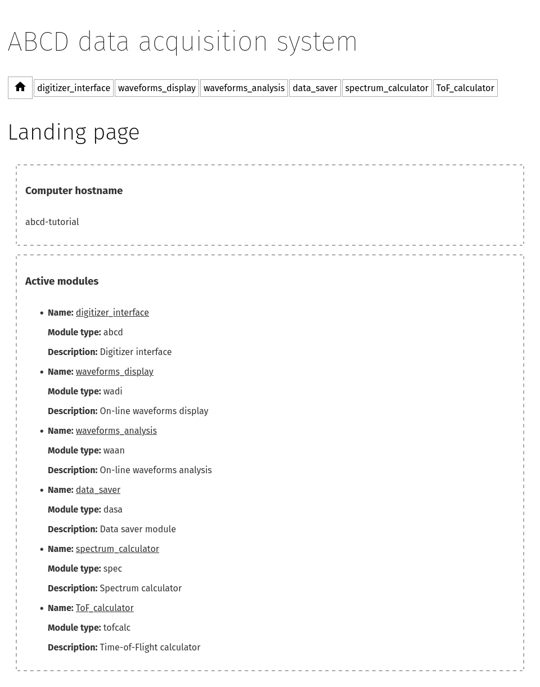
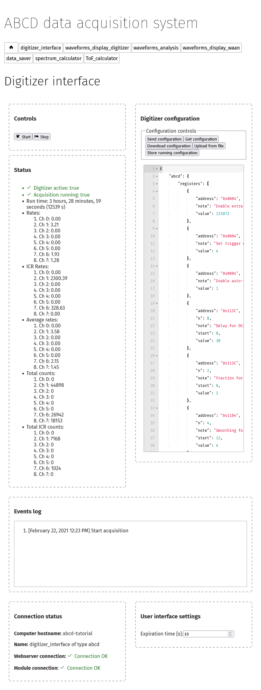
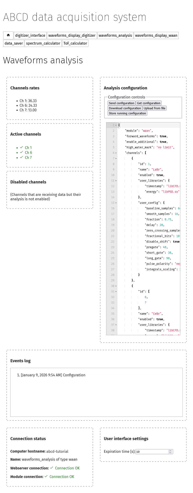
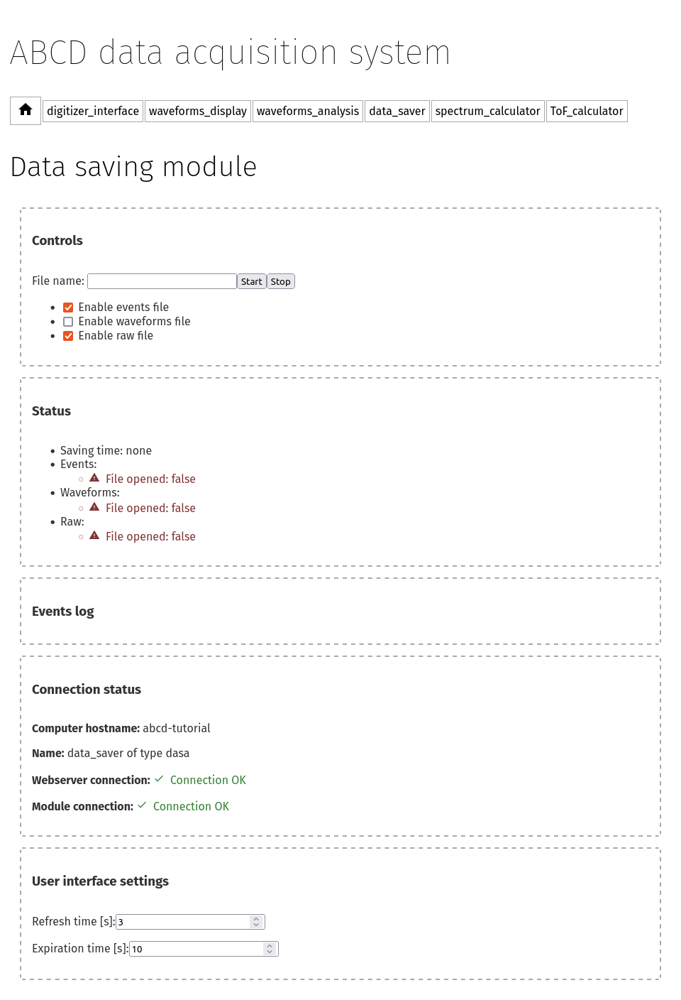
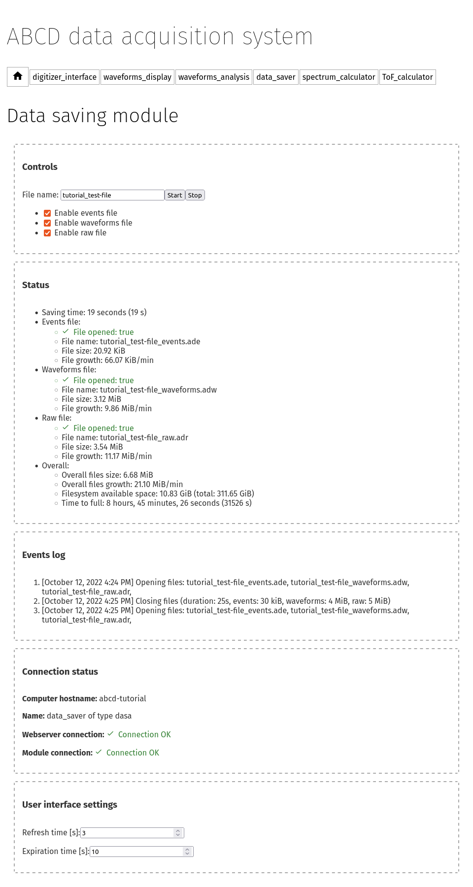

.. _ch-first-replay:

==============================================
Getting acquainted with a simulated experiment
==============================================

If ABCD was correctly installed (see :numref:`installation`) we can run a simulated experiment to get acquainted with the web-based interface.
ABCD supports the replaying of saved data files (for more information see :numref:`replay`).
Replaying a raw file allows to simulate a full working system.
The replay will display:

* The digitizer configuration;
* Relevant acquisition events (*e.g.* start, stop, reconfigurations, errors,...);
* Acquisition status during the replay (*e.g.* the measured acquisition rates);
* The configuration of the on-line waveforms processing (if it was used during the experiment);
* The acquired waveforms (if saved in the file) and processed events;

There is no need to have the hardware connected to the computer, if the user wants to re-run analyses on old data files or wants to debug analysis functions.
The simulation may also be used as a teaching aid for new users.
ABCD is delivered with some `example data files <https://github.com/ec-jrc/abcd/tree/main/data>`_ that can be used to get started.

Launching a replay
------------------

Some startup scripts are provided for a quick start (for more information see :numref:`ch-startup`).
The script `startup_example_replay.sh <https://github.com/ec-jrc/abcd/blob/main/startup/startup_example_replay.sh>`_ startups an ABCD instance with a default replay of an example data file.
The same script may be also used to replay any raw file (see :numref:`sec-startup-description`).

The default example data was acquired with a CAEN DT5730 digitizer.
Three detectors were attached:

* one LaBr detector on channel 1;
* two CeBr detectors on channels 6 and 7;

The digitizer was set to acquire only signals in coincidence between the LaBr (ch0) and either one of the CeBr (ch6 & ch7).
The CeBr detectors were detecting the internal radioactivity of the LaBr.

Let us launch the script from the main abcd folder::

    user-tutorial@abcd-tutorial:~/abcd$ ./startup/startup_example_replay.sh
    Today is 20220804
    Replaying data file: /home/user-tutorial/abcd//data/example_data_DT5730_Ch1_LaBr3_Ch6_CeBr3_Ch7_CeBr3_coincidence_raw.adr.bz2
    Kiling previous ABCD sessions
    Starting a new ABCD session
    Creating the window for the GUI webserver: WebInterfaceTwo
    ABCD:1.0
    Creating loggers window
    ABCD:2.0
    ABCD:2.1
    ABCD:2.1
    ABCD:2.1
    Waiting for node.js to start
    Creating replayer window, file: /home/user-tutorial/abcd//data/example_data_DT5730_Ch1_LaBr3_Ch6_CeBr3_Ch7_CeBr3_coincidence_raw.adr.bz2
    ABCD:3.0
    Creating WaAn window
    ABCD:4.0
    Creating DaSa window, folder: /home/user-tutorial/abcd//data/
    ABCD:5.0
    Creating WaDi window
    ABCD:6.0
    Creating tofcalc windows
    ABCD:7.0
    Creating spec windows
    ABCD:8.0
    System started!
    Connect to GUI on addresses: http://127.0.0.1:8080/

The script creates a ``tmux`` session in the background in which the ABCD instance runs (for more information about ``tmux`` see :numref:`sec-interface-command-line`).
Nothing will be displayed on the screen.
To interact with the user-interface connect with a web-browser to the address: http://127.0.0.1:8080/
The user-interface is hosted by a local web-server running on the local computer.
:numref:`fig-ABCD-landing-page-tutorial` shows the landing page that the browser should show; see :numref:`sec-check-running` if the browser cannot show the landing page.



    Landing page of the ABCD web-based user interface.

.. note::
    To navigate between module pages, we suggest to open them in new browser tabs, instead of clicking on their links to change the page.
    When a module page is opened for the first time, it takes several seconds to load all the information from the module.
    If the page was already loaded, the switching between modules' interfaces is faster and more pleasant.


The digitizer interface page
----------------------------



    Page of the digitizer interface while running a replay of example data.

Navigate now to the ``digitizer_interface`` page.
:numref:`fig-ABCD-digitizer-interface-replay` shows the page of the digitizer interface.
The top left pane shows the digitizer controls, that cannot do anything during a replay.
In a normal situation they would be used to start and stop the acquisitions.

The other left panes show the replay of the status of the digitizer during the acquisition.
The run-time is probably a bit too fast to be realistic, because a replay can be set to be faster than the real measurement.
This is useful for reanalyzing experiments with very low acquisition rates.
The shown rates are measured by the digitizer interface and tend to be a bit overestimated.
The ICR rates are something specific of CAEN digitizers and they are reliable only in high-rate experiments (tens of kHz).
The average rates are calculated over the whole acquisition time and are more realistic than the real-time ones.
The *Events log* show the relevant acquisition events saved in the raw file, in this example it will show the start and stop events with their timestamps.
The default replay is set to continuously repeat the data file, so in enough time the start and stop messages will accumulate.

The right pane contains a text editor that allows the user to modify the digitizer configuration from the web-interface, without the need of restarting the whole system at every reconfiguration.
The text editor is normally empty at the page load.
The user can click to *Get configuration* to read the current configuration of the digitizer.
The text editor will not update the configuration automatically, it always requires the user input.
This is to lower the risk of losing configurations in the case of another user is changing the configuration from another computer.
The user may change the configuration of the digitizer and send the updated version.
The text editor will signal to the user if the configuration format is not a correct JSON.
The digitizer interface will change the digitizer's configuration **only** when the **acquisition is not running**.
If a configuration is sent during an acquisition it will be ignored.
The digitizer interface will **never** store to a file the configuration that is sent from the web interface.
The user should manually download the configuration from the web-interface, otherwise the changes will be lost.
Automatically storing the configuration could create permissions problems.

.. note::
    The digitizer interface will change the digitizer's configuration only when the acquisition is not running.
    If a configuration is sent during an acquisition it will be ignored.

.. warning::
    The digitizer interface will never store to a file the configuration that is sent from the web interface.
    The user should manually download the configuration from the web-interface, otherwise the changes will be lost.

The waveforms display page
--------------------------

.. figure:: images/ABCD_waveforms_display.png
    :name: fig-ABCD-waveforms-display
    :width: 100%
    :alt: page of the waveforms display of the ABCD web-based user interface

    Page of the waveforms display while running a replay of example data.

Move on to the ``waveforms_display`` page by opening the link in a new tab.
:numref:`fig-ABCD-waveforms-display` shows the waveforms display page.
This page is a display of a very limited subset of the waveforms: no more than one waveform per channel every 3 s.
This is to give the highest priority to the data acquisition over the display.
The minimum time between waveforms refreshes is customizable in the startup with the ``-p`` option of the ``wadi`` module.

The top of the page shows the display controls:

* Which channel is shown.
* A switch to temporarily disable the waveforms update. It is useful in case a user wants to concentrate on the current waveform.
* A button to download the current waveform in a `CSV file <https://en.wikipedia.org/wiki/Comma-separated_values>`_. It is useful for saving a particular waveform shown. If a user wants to visualize all the waveforms from a channel we suggest to save them to file and use the provided tools (see :numref:`sec-display-plotting`).
* A button to reset the whole display of waveforms.

The middle of the page shows the actual waveform.
The top plot shows the waveform as read from the digitizer.
The bottom plot may be present or not, depending on the digitizer settings or of the waveforms processing module.
This second plot shows the so called *additional waveforms* that are waveforms associated with the physical one, but are used for debugging purposes of the waveforms processing module.
The meaning, order and type of display of these additional waveforms depend on the digitizer model and on the waveforms processing libraries.
Refer to the documentation of the digitizer or of the processing libraries for more information.
In the specific case of :numref:`fig-ABCD-waveforms-display`:

* Additional 0: shows a calculated Constant Fraction Discriminator (CFD) signal calculated from the waveform;
* Additional 1: shows the zero-crossing of the CFD together with its absolute maximum and minimum;
* Additional 2 and 3: show the integration gates used to determine the total energy and the Pulse Shape Discrimination information;
* Additional 4: shows the cumulative integral of the waveform (relative to the baseline).

In the plots a waveform may be hidden by clicking on it on the legend.
It is possible to save the plot as a PNG image by hovering on the plot and clicking on the little camera on the top-righ.
It is also possible to zoom into the plot by clicking and dragging.

.. _sec-waveforms-analysis-page:

The waveforms analysis page
---------------------------



    Web-interface of the general purpose waveforms analysis module ``waan``.

Move on to the ``waveforms_analysis`` page by opening the link in a new tab.
:numref:`fig-ABCD-waan` shows the web-interface of the general purpose waveforms processing module ``waan``.
The top panes show the measured rates of the enabled acquisition channels.
The user libraries may be filtering signals and thus discarding data.
The rates are shown after the filtering of the user libraries, so the user can immediately see the effect on the rate in case of filtering.
If there are channels in the incoming datastream that are not enabled in ``waan`` they are shown as *channels that are not analyzed*.

The user can click to *Get configuration* to read the current configuration of the waveforms processing.
The text editor will not update the configuration automatically, it always requires the user input.
This is to lower the risk of losing configurations in the case of another user is changing the configuration from another computer.
The user may change the configuration and send the updated version in any moment, the new configuration will immediately take over.
The text editor will signal to the user if the configuration format is not a correct JSON.
The currently running configuration of ``waan`` is also saved in the raw files.

.. warning::
    Updated configurations that are sent to ``waan`` from the web-interface are never stored on disk.
    The user should manually download the configuration from the web-interface, otherwise the changes will be lost (unless a raw file is currently opened).

Here it is possible to change the analysis configuration.
Try to modify some parameters and see how this immediately affect the waveforms display.
Refer to :numref:`sec-waan-config` for more information about the configuration file and to :numref:`ch-waan` for more information about ``waan``.

.. _sec-tutorial-saving-data:

Saving data
-----------

Replays of saved data simulate a full working system, for the whole framework there is no difference whether the data streams are generated by a physical digitizer or by a replay of old data.
Therefore even if this is a replay, we can still save the data streams.
For instance, this opens up the possibility of reanalyzing old waveforms data.

Move on to the ``data_saver`` page by opening the link in a new tab.
The module that reads data streams and saves them to disk is ``dasa``.
Files can be saved with the ABCD data formats (see :numref:`ch-data-files`).

Using the data saver
````````````````````



    Web-interface of the data saving module with no opened files.

:numref:`fig-ABCD-data-saver-empty` shows the ``dasa`` interface with no files opened.

Data files must be **opened before the start** of an acquisition, otherwise the acquired data before the file opening is lost.
This is an opposite approach of the systems in which the data is saved by the user at the end of the acquisition.
Opening files before the acquisition does not use hidden temporary files opaque to the user.
It also reduces the chances of data loss in case of crashes during an acquisition, the data saved before the crash is not lost.

Normally startup scripts (see :numref:`ch-startup`) set the data saving directory to: ``abcd/data/``.
The user must specify the file name in the web interface, if the file name is empty an automatic file name will be generated similar to: ``abcd_data_2022-08-03T16:56:05+0200_events.ade``.
The user can supply a full path in the file name entry, then the file will be saved to that path.
**There is no check** if a file already exist, so reopening files will **overwrite** them.
There is no associated timer to the opened files, the user has to stop the data acquisition when desired.
There is also the possibility of opening and closing files from the command line (see :numref:`sec-interface-command-line`).
The file opening and closing may also be automatized by a script using the command line interface.

.. warning::
    Data files must be opened before the start of an acquisition, otherwise the acquired data before the file opening is lost.

.. note::
    Opening a raw file before the start of the acquisition stores the start moment in the file.
    It could be useful later to remember when that data was saved.
    Similarly, closing the raw file after the start of the acquisition stores the stop moment in the file.
    It could also be useful to calculate the overall acquisition time.

.. warning::
    There is no check if a file already existing, so reopening files will overwrite them.

Information displayed during data saving
````````````````````````````````````````



    Web-interface of the data saving module with all the opened files.

:numref:`fig-ABCD-data-saver-open-files` shows the web-interface with opened files.
In the status section the data saver shows the opened files with some auxiliary information.
The growth rate represent the average amount of data saved to disk for the opened file, it could be useful to calculate how big a file would be at the end of an acquisition.

The events log show previous acquisitions with their acquisition times and the files dimensions.

Now try to save the example data to a new file that we will analyze later in the tutorial.