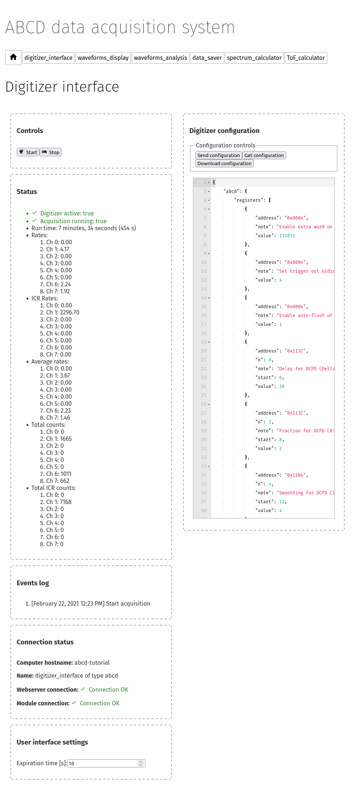
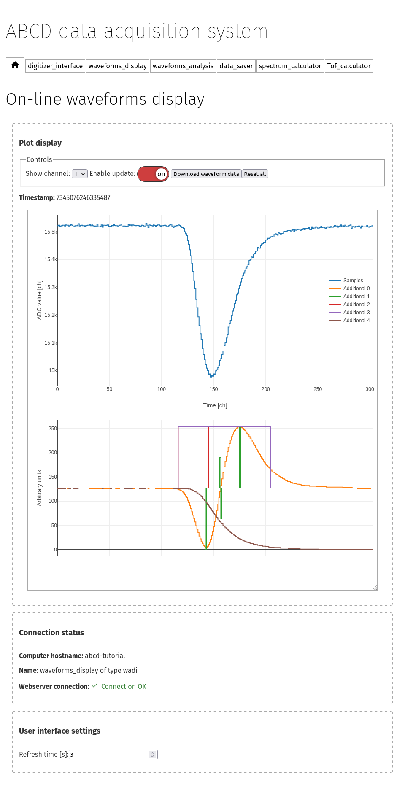
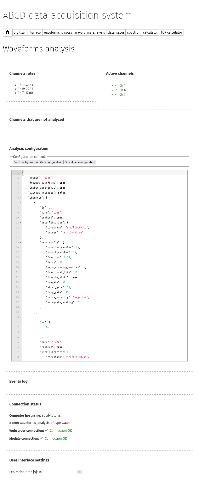

.. _ch-first-replay:

==============================================
Getting acquainted with a simulated experiment
==============================================

If ABCD was correctly installed (see :numref:`installation`), we can run a simulated experiment to get acquainted with the web-based interface.
ABCD supports the replaying of saved data files (for more information see :numref:`replay`).
Replaying a raw file allows to simulate a full working system.
The replay will display:

* The digitizer configuration;
* Relevant acquisition events (*e.g.* start, stop, reconfigurations, errors,...);
* Acquisition status during the replay (*e.g.* the measured acquisition rates);
* The configuration of the on-line waveforms processing (if it was used during the experiment);
* The acquired waveforms (if saved in the file) and processed events;

There is no need to have the hardware connected to the computer, if the user wants to re-run analyses on old data files or wants to debug analysis functions.
The simulation may also be used as a teaching aid for new users.
ABCD is delivered with some `example data files <https://github.com/ec-jrc/abcd/tree/main/data>`_ that can be used to get started.
The standard installation location for the example data is ``/usr/share/abcd/data``.
Do not expect to find excellent data that can lead to a publication, though!
The authors kept those for themselves...

Launching a replay
------------------

Some startup scripts are provided for a quick start (for more information see :numref:`ch-startup`), they can be found in ``/usr/share/abcd/startup/``.
The script ``startup_example_replay.sh`` (in ``/usr/share/abcd/startup/``) startups an ABCD instance with a default replay of an example data file.
The same script may be also used to replay any raw file (see :numref:`sec-startup-description`).

The default example data was acquired with a CAEN DT5730 digitizer.
Three detectors were attached:

* one LaBr detector on channel 1;
* two CeBr detectors on channels 6 and 7;

The digitizer was set to acquire only signals in coincidence between the LaBr (ch0) and either one of the CeBr (ch6 & ch7).
The CeBr detectors were detecting the internal radioactivity of the LaBr.

Let us launch the script from the main abcd folder::

    user-tutorial@abcd-tutorial:~$ mkdir abcd_tutorial
    user-tutorial@abcd-tutorial:~$ cd abcd_tutorial/
    user-tutorial@abcd-tutorial:~/abcd_tutorial$ cp /usr/share/abcd/startup/startup_example_replay.sh .
    user-tutorial@abcd-tutorial:~/abcd_tutorial$ ./startup_example_replay.sh
    Killing previous ABCD sessions
    Starting a new ABCD session
    Creating the window for the GUI webserver: WebInterfaceTwo
    ABCD:1.0
    Creating logger window
    ABCD:2.0
    Waiting for node.js to start
    Creating replayer window, replaying file: /usr/share/abcd/data/example_data_DT5730_Ch1_LaBr3_Ch6_CeBr3_Ch7_CeBr3_coincidence_raw.adr.bz2
    ABCD:3.0
    Creating WaAn window
    ABCD:4.0
    Creating DaSa window, directory: /home/localusr/abcd_tutorial/abcd_data_20260109/
    ABCD:5.0
    Creating WaDi windows
    ABCD:6.0
    ABCD:7.0
    Creating tofcalc window
    ABCD:8.0
    Creating spec window
    ABCD:9.0
    System started!
    Connect to GUI on addresses: http://127.0.0.1:8080/

The script creates a ``tmux`` session in the background in which the ABCD instance runs (for more information about ``tmux`` see :numref:`sec-interface-command-line`).
In the current working directory, a new directory is created with the name ``abcd_data_<today's date>``.
The data saver will save data in this new directory.
Nothing will be displayed on the screen during the execution of ABCD.
To interact with the user-interface connect with a web-browser to the address: http://127.0.0.1:8080/
The user-interface is hosted by a local web-server running on the local computer.
:numref:`fig-ABCD-landing-page-tutorial` shows the landing page that the browser should show; see :numref:`sec-check-running` if the browser cannot show the landing page.

.. figure:: images/ABCD_landing_page.png
    :name: fig-ABCD-landing-page-tutorial
    :width: 50%
    :alt: landing page of the ABCD web-based user interface

    Landing page of the ABCD web-based user interface.

.. note::
    To navigate between module pages, we suggest to open them in new browser tabs, instead of clicking on their links to change the page.
    When a module page is opened for the first time, it takes several seconds to load all the information from the module.
    If the page was already loaded, the switching between modules' interfaces is faster and more pleasant.

.. note::
    If ABCD is running inside the `Windows Subsystem for Linux 2 (WSL2) <https://en.wikipedia.org/wiki/Windows_Subsystem_for_Linux>`_ then the address for the web-interface might be different.
    Check https://learn.microsoft.com/en-us/windows/wsl/networking for more information.


The digitizer interface page
----------------------------



    Page of the digitizer interface while running a replay of example data.

Navigate now to the ``digitizer_interface`` page.
:numref:`fig-ABCD-digitizer-interface-replay` shows the page of the digitizer interface.
The top left pane shows the digitizer controls, that cannot do anything during a replay.
In a normal situation they would be used to start and stop the acquisitions.

The other left panes show the replay of the status of the digitizer during the acquisition.
The run-time is probably a bit too fast to be realistic, because a replay can be set to be faster than the real measurement.
This is useful for reanalyzing experiments with very low acquisition rates.
The shown rates are measured by the digitizer interface and tend to be a bit overestimated.
The ICR rates are hardware specific of CAEN digitizers and the SP Devices ADQ14.
For the CAEN digitizer they are reliable only in high-rate experiments (tens of kHz), for the ADQ14 they are reliable only in some specific conditions.
The average rates are calculated over the whole acquisition time and are more realistic than the real-time ones.
The *Events log* shows the relevant acquisition events saved in the raw file, in this example it will show the start and stop events with their timestamps.
The default replay is set to continuously repeat the data file, so in enough time the start and stop messages will accumulate.

The right pane contains a text editor that allows the user to modify the digitizer configuration from the web-interface, without the need of restarting the whole system at every reconfiguration.
The text editor is normally empty at the page load.
The user can click to *Get configuration* to read the current configuration of the digitizer.
The text editor will not update the configuration automatically, it always requires the user input.
This is to lower the risk of losing configurations in the case of another user is changing the configuration from another computer.
The user may change the configuration of the digitizer and send the updated version.
The text editor will signal to the user if the configuration format is not a correct JSON.
The digitizer interface will change the digitizer's configuration **only** when the **acquisition is not running**.
If a configuration is sent during an acquisition it will be ignored.
The digitizer interface will **never** save to a file the configuration that is sent from the web interface.
Saving to a file (storing) is only supported in the ``absp`` module and is is allowed **only** when the **acquisition is not running**.
The *Events log* will show an acknowledgement about the configuration saving.
For other modules, the user should manually download the configuration from the web-interface, otherwise the changes will be lost.
Automatically storing the configuration could create permissions problems and data loss.

.. note::
    The digitizer interface will change the digitizer's configuration only when the acquisition is not running.
    If a configuration is sent during an acquisition it will be ignored.

.. warning::
    The digitizer interface will never store to a file the configuration that is sent from the web interface.
    Saving to a file (storing) is only supported in the ``absp`` module and is is allowed only when the acquisition is not running.
    For other modules, the user should manually download the configuration from the web-interface, otherwise the changes will be lost.

The waveforms display pages
---------------------------



    Page of the waveforms display while running a replay of example data.

There are two available "waveforms display" pages: 

* ``waveforms_display_digitizer``: that displays the waveforms as they were acquired by the digitizer,
* ``waveforms_display_waan``: that displays the waveforms after the on-line analysis of ABCD (with the ``waan`` module).

Move on to the ``waveforms_display_waan`` page by opening the link in a new tab.
:numref:`fig-ABCD-waveforms-display` shows the waveforms display page.
This page is a display of a very limited subset of the waveforms: no more than one waveform per channel every 3 s.
This is to give the highest priority to the data acquisition over the display.
The minimum time between waveforms refreshes is customizable in the startup with the ``-p`` option of the ``wadi`` module.

The top of the page shows the display controls:

* Which channel is shown.
* A switch to temporarily disable the waveforms update. It is useful in case a user wants to concentrate on the current waveform.
* A button to download the current waveform as a `CSV file <https://en.wikipedia.org/wiki/Comma-separated_values>`_. It is useful for saving a particular waveform shown. If a user wants to visualize all the waveforms from a channel we suggest to save them to file and use the provided tools (see :numref:`sec-display-plotting`).
* A button to reset the whole display of waveforms.

The middle of the page shows the actual waveform.
The top plot shows the waveform as read from the digitizer.
The bottom plot may be present or not, depending on the digitizer settings or of the waveforms processing module.
This second plot shows the so called *additional waveforms* that are waveforms associated with the physical one, but are used for debugging purposes of the waveforms processing module.
The meaning, order and type of display of these additional waveforms depend on the digitizer model and on the waveforms processing libraries.
Refer to the documentation of the digitizer or of the processing libraries for more information.
In the specific case of :numref:`fig-ABCD-waveforms-display`:

* Additional 0: shows a calculated Constant Fraction Discriminator (CFD) signal calculated from the waveform;
* Additional 1: shows the zero-crossing of the CFD together with its absolute maximum and minimum;
* Additional 2 and 3: show the integration gates used to determine the total energy and the Pulse Shape Discrimination information;
* Additional 4: shows the cumulative integral of the waveform (relative to the baseline).

In the plots a waveform may be hidden by clicking on it on the legend.
It is possible to save the plot as a PNG image by hovering on the plot and clicking on the little camera on the top-right.
It is also possible to zoom into the plot by clicking and dragging.

.. _sec-waveforms-analysis-page:

The waveforms analysis page
---------------------------



    Web-interface of the general purpose waveforms analysis module ``waan``.

Move on to the ``waveforms_analysis`` page by opening the link in a new tab.
:numref:`fig-ABCD-waan` shows the web-interface of the general purpose waveforms processing module ``waan``.
The left panes show the measured rates of the enabled acquisition channels.
The user libraries may be filtering signals and thus discarding data.
The rates are shown after the filtering of the user libraries, so the user can immediately see the effect on the rate in case of filtering.
We suggest to compare the rates shown by ``waan`` and the rates of the digitizer interface.
If there are channels in the incoming datastream that are not enabled in ``waan`` they are shown as *Disabled channels*.

The user can click to *Get configuration* to read the current configuration of the waveforms processing.
The text editor will not update the configuration automatically, it always requires the user input.
This is to lower the risk of losing configurations in the case of another user is changing the configuration from another computer.
Differently than the digitizer interface, the user may change the configuration and send the updated version in any moment and the new configuration will immediately take over.
A configuration forces a reload of the analysis libraries.
If a user is working on a custom-analysis library then reconfiguring is necessary between modifications to the library.
The text editor will signal to the user if the configuration format is not a correct JSON.
The currently running configuration of ``waan`` is also stored in the raw files if they are being saved by the data saving module.
Updated configurations that are sent to ``waan`` from the web-interface are never stored to a file.
The user has the possibility of storing to a file the running configuration at any moment.
The *Events log* will show an acknowledgement about the configuration saving.
We stress the fact that only the running configuration is stored to disk and not the displayed configuration on the web interface, as they might be different.

.. warning::
    Updated configurations that are sent to ``waan`` from the web-interface are never stored to a file.
    The user has the possibility of storing to a file the running configuration at any moment.

Here it is possible to change the analysis configuration.
Try to modify some parameters and see how this immediately affect the waveforms display.
Refer to :numref:`sec-waan-config` for more information about the configuration file and to :numref:`ch-waan` for more information about ``waan``.

.. _sec-tutorial-saving-data:

The saving data page
--------------------

Replays of saved data simulate a full working system, for the whole framework there is no difference whether the data streams are generated by a physical digitizer or by a replay of old data.
Therefore even if this is a replay, we can still save the data streams.
For instance, this opens up the possibility of reanalyzing old waveforms data.

Move on to the ``data_saver`` page by opening the link in a new tab.
The module that reads data streams and saves them to disk is ``dasa``.
Files can be saved with the ABCD data formats (see :numref:`ch-data-files`).

Using the data saver
````````````````````

.. figure:: images/ABCD_data_saver_empty.png
    :name: fig-ABCD-data-saver-empty
    :width: 50%
    :alt: interface of the data saver module with no opened files

    Web-interface of the data saving module with no opened files.

:numref:`fig-ABCD-data-saver-empty` shows the ``dasa`` interface with no files opened.

Data files must be **opened before the start** of an acquisition, otherwise the acquired data before the file opening is lost.
This is an opposite approach of the systems in which the data is saved by the user at the end of the acquisition.
Opening files before the acquisition does not use hidden temporary files opaque to the user.
It also reduces the chances of data loss in case of crashes during an acquisition, the data saved before the crash is not lost.
Opening the files before the start also stores the start moment in the raw files.
It could be useful later to remember when that data was saved.
Similarly, closing the raw file after the start of the acquisition stores the stop moment in the file.
It could also be useful to calculate the overall acquisition time.

Normally startup scripts (see :numref:`ch-startup`) create a new saving directory to that is shown in the "Current work directory" section.
The work directory may be changed with the proper command by giving a **full, correct, path**.
The user must specify the file name in the web interface, if the file name is empty an automatic file name will be generated similar to: ``abcd_data_2022-08-03T16:56:05+0200_events.ade``.
The user can supply a full path in the file name entry, then the file will be saved to that path.
**There is no check** if a file already exist, so reopening files will **overwrite** them.
There is no associated timer to the opened files, the user has to stop the data acquisition when desired.
There is also the possibility of opening and closing files from the command line (see :numref:`sec-interface-command-line`).
The file opening and closing may also be automatized by a script using the command line interface.

.. warning::
    Data files must be opened before the start of an acquisition, otherwise the acquired data before the file opening is lost.

.. note::
    Opening a raw file before the start of the acquisition stores the start moment in the file.
    It could be useful later to remember when that data was saved.
    Similarly, closing the raw file after the start of the acquisition stores the stop moment in the file.
    It could also be useful to calculate the overall acquisition time.

.. warning::
    There is no check if a file already existing, so reopening files will overwrite them.

Information displayed during data saving
````````````````````````````````````````


    Web-interface of the data saving module with all the opened files.

:numref:`fig-ABCD-data-saver-open-files` shows the web-interface with opened files.
In the status section the data saver shows the opened files with some auxiliary information.
The overall information gives the sum of the file size of all the opened files during this run.
The growth rate represent the average amount of data saved to disk for the opened files.
There is also an indication of the available space in the filesystem to which the files are saved.
This information might not be available for some filesystems.
The user-interface calculates the expected time until the filesystem is filled up, according to the current file growth.

The events log show previous acquisitions with their acquisition times and the files dimensions.

Now try to save the example data to a new file that we will analyze later in the tutorial.

.. _sec-tutorial-spectrum-calculator:

The spectrum calculator page
----------------------------


    Web-interface of the spectrum calculator module ``spec``.

Move on to the ``spectrum_calculator`` page by opening the link in a new tab.
:numref:`fig-ABCD-spectrum-calculator` shows the interface of the spectrum calculator module ``spec``.

Pulse Shape Discrimination calculation
``````````````````````````````````````

The top plot of the top pane shows the calculated spectrum of the selected channel.
The bottom plot shows the bidimensional histogram of the Pulse Shape Discrimination (PSD) parameter vs the energy.
In the ``spec`` the PSD parameter is calculated accordingly to

.. math:: \text{PSD parameter} = \frac{Q_{\text{long}} - Q_{\text{short}}}{Q_{\text{long}}} = \frac{Q_{\text{tail}}}{Q_{\text{long}}}
    :label: eq-tutorial-PSD


Where :math:`Q_{\text{long}}` and :math:`Q_{\text{short}}` refer to the results of the two integration results over two intervals for the traditional double integration method for PSD.
Sometimes the numerator is also called :math:`Q_{\text{tail}}` as it normally represents the tail of the pulses.
:math:`Q_{\text{long}}` and :math:`Q_{\text{short}}` are the two ``Q`` entries in the processed events binary representation (see :numref:`sec-binary-protocol-events`).
In general the two values may be calculated differently by the various user libraries of the waveforms analysis module (*e.g.* one may be substituted by the pulse height).
Whatever the calculations of the two values is, the ``spec`` will calculate that parameter with equation :eq:`eq-tutorial-PSD`.

In the ``spec`` settings there is the possibility of changing the ``spectra_type``, which changes which entry is interpreted as the energy values of a processed event.
This means that either the :math:`Q_{\text{long}}`, :math:`Q_{\text{short}}` or baseline may be used to generate the energy spectra.
Also the PSD calculation is affected by this setting.

.. _sec-tutorial-spec-time-decay:

Time decay of spectra
`````````````````````

In the ``spec`` module it is possible to enable the time decay of spectra.
The histograms counts decay in time with an exponential decay with a user-supplied characteristic time.
New statistics is added on top of the previously decayed counts.
This feature allows to continuously monitor the evolution in time of the energy spectra.
For instance it is useful for optimizing detectors geometries or configurations, seeing in real time the effects.

The decay constant is calculated according to:

.. math:: d = \mathrm{e}^{-\Delta t / \tau}
    :label: eq-spec-time-decay

Where :math:`d` is the decay constant that is multiplied to the histograms counts at every publication.
:math:`\Delta t` is the time since the last publication and :math:`\tau` is the user-supplied characteristic time.

.. _sec-tutorial-spec-plot-controls:

Plotting controls
`````````````````

The plot controls are:

* Selection of the shown channel
* A button to download the current spectrum as a `CSV file <https://en.wikipedia.org/wiki/Comma-separated_values>`_.
  If a user wants to generate plots with more advanced options we suggest to save data to file and use the provided tools (see :numref:`sec-display-plotting`).
* A button to fit the currently shown portion of the energy spectrum.
  The fit uses a Gaussian function with a simple linear background.
  The fitting function is not customizable.
  The fit results are shown in the pane below the plot.
  During the data inflow the fit is continuously updated with the new statistics, even though sometimes it goes astray and it should be deleted and recalculated.
* A button to delete all the fits.
* A button to reset the currently shown channel.
* A button to reset all the active channels.

It is possible to save the plot as a PNG image by hovering on the plot and clicking on the little camera on the top-right.
It is also possible to zoom into the plot by clicking and dragging.

The rates on the page are calculated by ``spec`` and thus they show the amount of data that it actually receives.
They are therefore less than or roughly equal to the rates shown in the digitizer interface, because the data processing might have filters that reduce the amount of data.
If rates are too small or null, there could be a filter somewhere completely blocking data.

.. note::

    The ``spec`` module only receives the data streams from the rest of the framework.
    Therefore it is independent from starts and stops of the digitizer or of the waveforms analysis module.
    If some configurations change we suggest to reset the channels, otherwise the new statistics will accumulate on top of the old, that might cause non-physical artifacts in the spectra.
    It is also possible to accumulate the spectra over various acquisitions, by not resetting the channels.

The channels configuration
``````````````````````````

The bottom pane shows the configuration of the ``spec`` module.
It behaves similarly to the ``waan`` and ``tofcalc`` modules (see :numref:`sec-waveforms-analysis-page` and :numref:`sec-tutorial-tof-calculator`).
THe page at first will show an empty configuration.
The user can click to *Get configuration* to read the current configuration.
The text editor will **not** update the configuration automatically, it always requires the user input.
The text editor will signal to the user if the configuration format is not a correct JSON.
Channels, that are supposed to have the same configuration, may be grouped in the ``id`` entry (as in the ``waan`` configuration, see :numref:`sec-waan-config`).
The ``id`` entry may be a single integer number, that indicates the channel to which these settings apply.
It may be substituted with an array of integer values, indicating that these settings are to be replicated to all these channels.

The user may change the configuration and send the updated version in any moment, the new configuration will immediately take over.
A reconfiguration implies a reset of the channels statistics and it might take several seconds, thus be patient.
The reason for this delay is to give precedence to the data acquisition and not to the data visualization.
We suggest not to use too many bins in the spectra, as it can considerably increase the memory consumption of the web page.
This page is meant to be an on-line visualization tool, for mote detailed analyses we suggest to use the provided tools (see :numref:`sec-display-plotting`).

.. warning::
    Updated configurations that are sent to ``spec`` from the web-interface are never stored on disk.
    The user should manually download the configuration from the web-interface, otherwise the changes will be lost.

Try to modify some parameters and see how this immediately affects the spectra.

Try to modify the parameters of the waveforms analysis and see their effect on the ToF spectra.
Try to enable the time decay with a very short time, the spectrum counts will start to drop and settle to a low value.
The replay will continue to supply data and thus the two processes will arrive to an equilibrium value.

Missing spectra of active channels
``````````````````````````````````

The ``spec`` module automatically creates new spectra if it detects data generated by channels that are not in the active list.
If the user clicks on *Get configuration* the new channels should appear in the configuration.
If a channel does not appear in the interface, it means that there was no data generated by it.
Is the channel active both in the digitizer and waveforms analysis configurations?
Is there a filter that deletes all the data?
If the waveforms analysis module shows a zero rate on that channel, then the ``spec`` will not create a new spectrum.

.. _sec-tutorial-tof-calculator:

The Time-of-Flight (ToF) calculator page
----------------------------------------


    Web-interface of the Time-of-Flight (ToF) calculator module ``tofcalc``.

Move on to the last page of this tutorial, the ``ToF_calculator`` page by opening the link in a new tab.
:numref:`fig-ABCD-ToF-calculator` shows the interface of the ToF calculator module ``tofcalc``.

The ``tofcalc`` module calculates time differences between the pulses of reference channels and the other channels (for a more detailed explanation see :numref:`ch-tofcalc`).
The pulses of the reference channels constitute the time zero for the coincidence window.
Since the reference pulse is the time zero, it corresponds to a time offset.
Time differences are calculated accordingly subtracting the time zero from the timestamps of the other channels.
Energy histograms are calculated only within the coincidence windows, thus they are probably going to be different than the results of the ``spec``.

.. _sec-tutorial-tof-plot-controls:

Plotting controls
`````````````````

The controls of the plots are similar to the ``spec`` interface.
The plot controls are:

* Selection of the shown channel.
  **Reference channels cannot be shown**, as they constitute the reference for other channels and their ToFs would always be zero.
* A button to download the current ToF spectrum or energy spectrum in a `CSV file <https://en.wikipedia.org/wiki/Comma-separated_values>`_.
  If a user wants to generate plots with more advanced options we suggest to save data to file and use the provided tools (see :numref:`sec-display-plotting`).
* A button to fit the currently shown portion of the ToF or energy spectra.
  The fit works as in the interface of the ``spec`` module (see :numref:`sec-tutorial-spec-plot-controls`).
* A button to delete all the fits.
* A button to reset the currently shown channel.
* A button to reset all the active channels.

It is possible to save the plot as a PNG image by hovering on the plot and clicking on the little camera on the top-right.
It is also possible to zoom into the plot by clicking and dragging.

The rates on the page are calculated by ``tofcalc`` and thus they show the amount of data that it actually receives.
Only the events in coincidence with the reference channels are calculated in the rate, therefore they are probably going to be smaller.

.. note::

    The ``tofcalc`` module only receives the data streams from the rest of the framework.
    Therefore it is independent from starts and stops of the digitizer or of the waveforms analysis module.
    If some configurations change we suggest to reset the channels, otherwise the new statistics will accumulate on top of the old, that might cause non-physical artifacts in the spectra.
    It is also possible to accumulate the spectra over various acquisitions, by not resetting the channels.

The channels configuration
``````````````````````````

The bottom pane shows the configuration of the ``tofcalc`` module.
It behaves similarly to the ``spec`` and ``waan`` module (see :numref:`sec-tutorial-spectrum-calculator` and :numref:`sec-waveforms-analysis-page`).
The user can click to *Get configuration* to read the current configuration of the ToF calculator.
The text editor will **not** update the configuration automatically, it always requires the user input.
The user may change the configuration and send the updated version in any moment, the new configuration will immediately take over.
The text editor will signal to the user if the configuration format is not a correct JSON.

.. warning::
    Updated configurations that are sent to ``tofcalc`` from the web-interface are never stored on disk.
    The user should manually download the configuration from the web-interface, otherwise the changes will be lost.

Try to modify some parameters and see how this immediately affect the waveforms display.
Refer to :numref:`sec-tofcalc-config` for more information about the configuration file and to :numref:`ch-tofcalc` for more information about ``tofcalc``.

Try again to modify the parameters of the waveforms analysis and see their effect on the ToF spectra.
Try also to enable the histograms decay while modifying the parameters to see the effects on the spectra.

Shutting down ABCD
------------------

Congratulations! With this we finished the first tutorial focused on the web-interface of ABCD.
We can now shut down the running ABCD instance with the script `stop_ABCD.sh <https://github.com/ec-jrc/abcd/blob/main/startup/stop_ABCD.sh>`_.
The next step is to analyze off-line the events files with the provided tools of ABCD.
