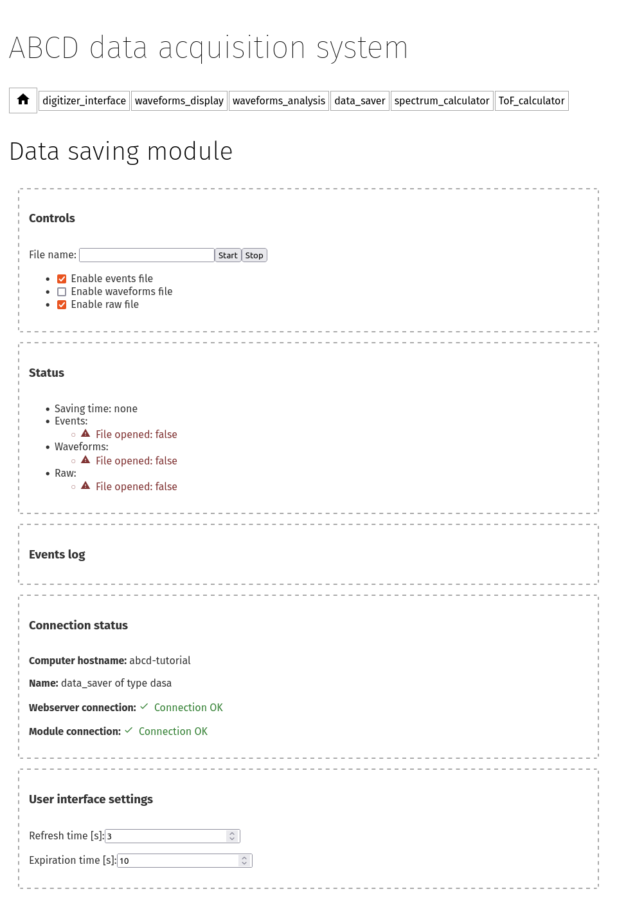

===========
Saving data
===========

Files can be saved with the ABCD data format (see :numref:`ch-data-files`).
The module that reads datastreams and saves them to disk is ``dasa`` and in the web-interface is identified as *data_saver* (see :numref:`fig-ABCD-data-saver-empty`).

    Web-interface of the data saving module with no opened files.

Using the data saver
--------------------

Data files must be **opened before the start** of an acquisition, otherwise the acquired data before the file opening is lost.
Normally startup scripts (see :numref:`ch-startup`) set the data saving directory to: ``abcd/data/``.
The user must specify the file name in the web interface, if the file name is empty an automatic file name will be generated similar to: ``abcd_data_2022-08-03T16:56:05+0200_events.ade``.
The user can supply a full path in the file name entry, then the file will be saved to that path.
**There is no check** if a file already existing, so reopening files will **overwrite** them.
There is no associated timer to the opened files, the user has to stop the data acquisition when desired.
There is also the possibility of opening and closing files from the command line (see :numref:`sec-interface-command-line`).
The file opening and closing may also be automatized by a script using the command line interface.

.. warning::
    Data files must be opened before the start of an acquisition, otherwise the acquired data before the file opening is lost.

.. note::
    Opening a raw file before the start of the acquisition stores the start moment in the file.
    It could be useful later to remember when that data was saved.
    Similarly, closing the raw file after the start of the acquisition stores the stop moment in the file.
    It could also be useful to calculate the overall acquisition time.

.. warning::
    There is no check if a file already existing, so reopening files will overwrite them.

Information displayed during data saving
----------------------------------------

.. figure:: images/ABCD_data_saver_open_files.png
    :name: fig-ABCD-data-saver-open-files
    :width: 100%
    :alt: interface of the data saver module with opened files

    Web-interface of the data saving module with all the opened files.

:numref:`fig-ABCD-data-saver-open-files` shows the web-interface with opened files.
In the status section the data saver shows the opened files with some auxiliary information.
The growth rate represent the average amount of data saved to disk for the opened file, it could be useful to calculate how big a file would be at the end of an acquisition.

The events log show previous acquisitions with their acquisition times and the files dimensions.