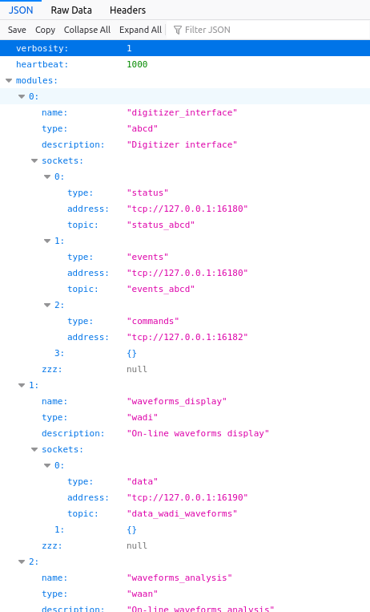
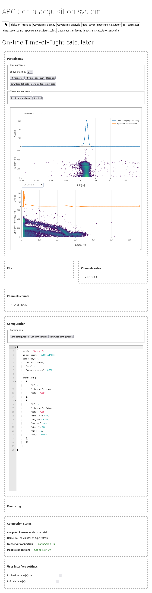
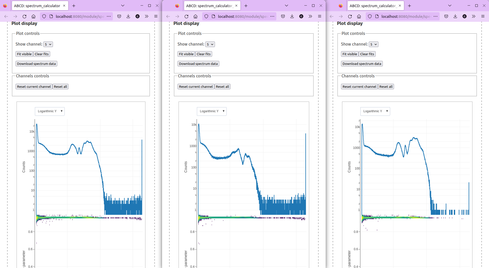

.. _ch-startup-writing:

========================================
Advanced topic: writing a startup script
========================================

.. warning::

    This tutorial is outdated since the ABCD compilation is managed by CMake.

In this tutorial we will see:

- How to connect different processes through their sockets;
- How to launch an ABCD session in the background with tmux;
- How to configure the web-interface to connect different modules.

The startup script that we are going to prepare in this tutorial will create an ABCD session with the ``cofi`` (see :numref:`ch-cofi`) module to select coincidence and anticoincidence events between a detector and an anti-compton shield.
The two detectors were connected to channels:

- Channel 4: BGO anticompton shield;
- Channel 5: LaCl(Ce) detector inside the BGO shield.

As in the other sections of this tutorial, we will use some example data that will be replayed.
The effects of the coincidence and anticoincidence selection will be shown on three parallel ``spec`` (see :numref:`sec-tutorial-spectrum-calculator`) modules that will calculate the energy spectra on-line.
:numref:`diagram-startup-writing` shows the connections diagram for the data sockets of this tutorial.
The various copies of the ``spec`` module are indicated with a number (*i.e.* ``spec1``, ``spec2``, and ``spec3``)
There are also multiple copies of the ``dasa`` module, in order to save the data streams on three different files for further processing.

.. code-block:: none
    :name: diagram-startup-writing
    :caption: Simplified diagram of the modules connections for analyzing coincidence data. TCP port numbers for data sockets are indicated on the data streams.

                       +-----------------+
                       |      Data       |
                       |    replaying    |
                       |     process     |
                       | "replay_events" |
                       +-----------------+
                                :
            Singles data socket :
                tcp port: 16181 :
              ..................:.............................
              :                 :               :            :
              V                 V               V            V
      +----------------+ +-------------+ +-------------+ +--------+
      | Time-of-Flight | | Coincidence | |   On-line   | |  Data  |
      |  calculation   | |   filter    | |   spectra   | | saving |
      |   "tofcalc"    | |   "cofi"    | | calculation | | module |
      |                | |             | |   "spec1"   | | "dasa1"|
      +----------------+ +-------------+ +-------------+ +--------+
                            :       :
    Coincidence data socket :       : Anticoincidence data socket
            tcp port: 17181 :       : tcp port: 18181
               ............ :       ...........................
               :            :                    :            :     
               v            V                    v            V     
        +-------------+ +--------+        +-------------+ +--------+
        |   On-line   | |  Data  |        |   On-line   | |  Data  |
        |   spectra   | | saving |        |   spectra   | | saving |
        | calculation | | module |        | calculation | | module |
        |   "spec2"   | | "dasa2"|        |   "spec3"   | | "dasa3"|
        +-------------+ +--------+        +-------------+ +--------+

.. _sec-startup-writing-introduction:

Starting up approach
--------------------

ABCD is meant to run in the background, which means that the user should not need to keep a terminal open with the processes in execution.
The user interface is web-based and thus the user should use a web-browser to interact with the framework.
There are several approaches to run a process in the background (*e.g.* `disown <https://en.wikipedia.org/wiki/Disown_(Unix)>`_, `nohup <https://en.wikipedia.org/wiki/Nohup>`_, or using `terminal multiplexers <https://en.wikipedia.org/wiki/Terminal_multiplexer>`_), we opted to run the ABCD processes inside an instance of `tmux <https://en.wikipedia.org/wiki/Tmux>`_.
tmux allows to run several processes inside a session, in different windows and panes.
The user may *attach* to the session and see a window with the running process (see :numref:`sec-interface-command-line`).
Then the user may *detach* from the session without stopping the processes execution.
The ABCD processes will be running in different windows.

.. _sec-startup-writing-variables:

Environment variables
---------------------

In order to properly start the framework we need some information that depend on the user preferences.
We will put these in variables for the script so they may be easily changed in the future.
If a user is not willing to modify the startup script, there is the possibility of storing this information in `environment variables of the shell <https://opensource.com/article/19/8/what-are-environment-variables>`_.

The most important information is the folder in which the framework is installed.
The script will start to determine if the environment variable ``${ABCD_FOLDER}`` is set using the bash conditional statement `if <https://tldp.org/LDP/Bash-Beginners-Guide/html/sect_07_01.html>`_.
If the variable is not set then the script will use a default value of ``"$HOME""/abcd/"``.
Here we could set the variable to the actual folder in which we have installed ABCD.

..  code-block:: bash

    # Check if the ABCD_FOLDER variable is set in the environment, otherwise set it here
    if [[ -z "${ABCD_FOLDER}" ]]; then
        # The variable is not set, thus the user should set it to the folder in which ABCD is installed
        ABCD_FOLDER="$HOME""/abcd/"
    fi

Another important information is the folder in which data should be saved.
This is stored in the environment variable ``${DATA_FOLDER}``.
     
..  code-block:: bash

    # Folder in which data should be saved
    # Check if the DATA_FOLDER variable is set in the environment, otherwise set it here
    if [[ -z "${DATA_FOLDER}" ]]; then
        # The variable is not set, thus the user should set it to the data destination folder
        DATA_FOLDER="${ABCD_FOLDER}""/data/"
    fi
    
For this startup script we will allow the possibility of passing the file to be replayed as an argument to this very startup script.
Command line arguments are passed to scripts in environment variables that have numbers as names.
In this case we want to use the first argument (variable ``$1``) as the file name.
If no argument is given then the script will use some example data available in the ABCD repository.

..  code-block:: bash
     
    # The file to be replayed is passed as an argument to this script
    if [[ -z "$1" ]]
    then
        # If no argument is given, then use the default example file
        FILE_NAME="${ABCD_FOLDER}/data/example_data_SPD214_Ch4_BGO_anticompton_Ch5_LaCl_background_events.ade"
    else
        FILE_NAME="$1"
    fi
     
Another parameter that the user might want to modify is the reference channel for the coincidences determination.
Again the script will check if it is already set, otherwise it will use a default value.

..  code-block:: bash
     
    # This check if this variable is set in the environment.
    # It should contain the space-separated list of reference channels for the coincidence determination
    if [[ -z "${REFERENCE_CHANNELS}" ]]
    then
        REFERENCE_CHANNELS="4"
    fi
    
Finally there are some more useful variables used in the script, that are pretty much self explanatory.

..  code-block:: bash

    CURRENT_FOLDER="$PWD"

    TODAY="`date "+%Y%m%d"`"
    echo 'Today is '"$TODAY"
    
    # Unsetting $TMUX in order to be able to launch new sessions from tmux
    unset TMUX

.. _sec-startup-writing-check:

Installation verification
-------------------------

We should always assume that a user might commit mistakes when trying to launch an instance.
For instance if the user has not set the variable ``${ABCD_FOLDER}`` then the script would unsuccessfully try to startup an ABCD instance.
Since ABCD is meant to run in the background, there would be not evident way for the user to see that the script failed.
The user would just try to connect to the web interface and it would simply not work with no information.
A similar situation would happen if the user has installed ABCD in the default folder of the script, but did not compile the framework.
Again, the script would not be able to launch the processes with no evident error message.

In this tutorial we will be using the ``cofi`` module and we can use that as a representative for the whole framework.
The script will check if the ``cofi`` executable exists and is executable.
If it is not the case, then it will give some suggestions to the user for troubleshooting.

..  code-block:: bash

    # Check if the cofi module is executable.
    # This is an indication that ABCD was at least compiled and the ${ABCD_FOLDER} is correctly set.
    if [[ ! -x "${ABCD_FOLDER}/cofi/cofi" ]]
    then
        printf '\e[1m\e[31mERROR:\e[0m cofi is not executable.\n'
        printf '\e[1m\e[32mSuggestions:\e[0m Was ABCD correctly compiled?\n'
        printf '             Is the ${ABCD_FOLDER} variable set correctly in the environment or in the script?\n'
    else
        #...
        # Here goes the rest of the startup script...
        #...
    fi

.. _sec-startup-writing-session:

tmux session startup
--------------------

Multiple sessions of ABCD may be running in parallel, but the user needs to make sure that there is no overlap between the communication sockets of the various modules.
When a module starts, it tries to create the necessary sockets for communication.
If there is another process that is already bound to an address, then the start will fail because it will be unable to bind to the desired address.
For more information about the sockets and the addresses we suggest to check the `documentation of the ZeroMQ library <https://zguide.zeromq.org/docs/chapter2/>`_.
For this script we will assume that this is the only allowed session of ABCD, in order to avoid conflicts.
Therefore, before initiating a new tmux session we need to make sure that there is no other session with the same name.
If there is another session the script will simply kill it.
Then it will wait a couple of seconds to let all the processes to be closed.
Finally it will start a new tmux session with name: "ABCD."
This new session will start a new window with an empty shell.
We will leave this shell running for convenience in case we want to attach to the ABCD session.
The other processes will run in new windows.

.. code-block:: bash

    # Checking if another ABCD session is running
    if [ "`tmux ls 2> /dev/null | grep ABCD | wc -l`" -gt 0 ]
    then
        echo "Kiling previous ABCD sessions"
        tmux kill-session -t ABCD
        sleep 2
    fi
    
    echo "Starting a new ABCD session"
    tmux new-session -d -s ABCD
   
.. _sec-startup-writing-wit:

Web-server for the user interface
---------------------------------

The first process that we are going to start is ``wit``, the web-server hosting the user interface.
The ``wit`` is the interface for the user for all the modules that expect commands from the user or provide data for visualization.
It should therefore know which modules are active and the relative sockets to intermediate between the web-browser and the modules.
The sockets are specified in the configuration file of ``wit``, that is in the usual JSON format.
The `default configuration <https://github.com/ec-jrc/abcd/blob/main/wit/config.json>`_ is meant to be used in a rather standard ABCD session.
For the session that we are preparing we need more modules than the standard set.
We need thee instances of ``spec`` and three of ``dasa``, while the default configuration only foresees one for each.
You can try to open the `default configuration <https://github.com/ec-jrc/abcd/blob/main/wit/config.json>`_ with a simple text editor (not a word processor) and see its structure.
The Firefox browser has the nifty built-in feature of showing JSON files with an interactive visualization (see :numref:`fig-wit-config`), you can use the browser to access the configuration file.
The path depends on where the ABCD folder is, for instance our file resides at file:///home/user-tutorial/abcd/wit/config.json 

    Interactive visualization in Firefox of the default ``wit`` configuration file in the JSON format.

In the configuration file there is the ``modules`` entry that lists all the modules that are to be interfaced by ``wit``.
Scroll to find the ``spec`` specification.

.. code-block:: JSON

    {
        "name": "spectrum_calculator",
        "type": "spec",
        "description": "Spectrum calculator",
        "sockets": [
        {
            "type": "status",
            "address": "tcp://127.0.0.1:16187",
            "topic": "status_spec"
        },
        { 
            "type": "events",
            "address": "tcp://127.0.0.1:16187",
            "topic": "events_spec"            
        },
        { 
            "type": "data",
            "address": "tcp://127.0.0.1:16188",
            "topic": "data_spec_histograms"
        },
        {
            "type": "commands",
            "address": "tcp://127.0.0.1:16189"
        },
        {}
        ],
        "zzz": null
    },

We see that in this specification there is a ``type`` specified, that in this case it is ``spec``.
This ``type`` informs ``wit`` which type of module it is and which interface should it load for it.
The ``name`` entry is a unique identifier for this module for the session that we are starting up.
The ``description`` is a string describing the module purpose, that is also shown in the user-interface.
Finally there is a ``sockets`` entry with the list of associated sockets to this module.
Each socket has a ``type``, an ``address`` and a ``topic``.

We can use this configuration to prepare the configurations for the two missing entries of ``spec``.

.. code-block:: JSON

    {     
        "name": "spectrum_calculator_coinc",
        "type": "spec",
        "description": "Spectrum calculator in coincidence",
        "sockets": [
        { 
            "type": "status",
            "address": "tcp://127.0.0.1:17187",
            "topic": "status_spec"
        },
        {
            "type": "events",  
            "address": "tcp://127.0.0.1:17187",
            "topic": "events_spec"
        },
        { 
            "type": "data",
            "address": "tcp://127.0.0.1:17188",
            "topic": "data_spec_histograms"
        },
        {
            "type": "commands",
            "address": "tcp://127.0.0.1:17189"
        },
        {}
        ],
        "zzz": null
    },
    {
        "name": "spectrum_calculator_anticoinc",
        "type": "spec",
        "description": "Spectrum calculator in anticoincidence",
        "sockets": [
        {
            "type": "status",
            "address": "tcp://127.0.0.1:18187",
            "topic": "status_spec"
        },
        {
            "type": "events",
            "address": "tcp://127.0.0.1:18187",
            "topic": "events_spec"
        },
        {
            "type": "data",
            "address": "tcp://127.0.0.1:18188",
            "topic": "data_spec_histograms"
        },
        {
            "type": "commands",
            "address": "tcp://127.0.0.1:18189"
        },
        {}
        ],
        "zzz": null
    },

In these two new entries we modified the ``name`` in order to have a uniquely identifier for each ``spec``.
The two new names are ``spectrum_calculator_coinc`` and ``spectrum_calculator_anticoinc``.
Make sure that they are unique in the configuration file.
We modified the ``description`` entry to indicate what are the differences of these ``spec`` entries.
We also modified the addresses of the sockets, in order not to have overlaps.
The default port numbers of ``spec`` are 16187, 16188, 16189.
The new instances of spec should not use the same numbers, but they should not port numbers used by **any** other process running on the computer.
The list of all the ports used by default by ABCD is in: https://github.com/ec-jrc/abcd/blob/main/include/defaults.h
For this example we used the port numbers: 17187, 17188, 17189, 18187, 18188, 18189.
If you are asking yourself what numbers should be used for the sockets, the answer is some numbers that are not already used by any process.
Luckily on our computer those numbers were not in use...
The other settings may be leaved as they are.

The configuration for ``dasa`` is similar but somewhat simpler.

.. code-block:: JSON

    {
        "name": "data_saver",
        "type": "dasa",
        "description": "Data saver module",
        "sockets": [
        {
            "type": "status",
            "address": "tcp://127.0.0.1:16185",
            "topic": "status_lmno"
        },
        {
            "type": "events",
            "address": "tcp://127.0.0.1:16185",
            "topic": "events_lmno"
        },
        {
            "type": "commands",
            "address": "tcp://127.0.0.1:16186"
        },
        {}
        ],
        "zzz": null
    },

Also in this case we need to add two entries.

.. code-block:: JSON

    {
        "name": "data_saver_coinc",
        "type": "dasa",
        "description": "Data saver module in coincidence",
        "sockets": [
        {
            "type": "status",
            "address": "tcp://127.0.0.1:17185",
            "topic": "status_lmno"
        },
        {
            "type": "events",
            "address": "tcp://127.0.0.1:17185",
            "topic": "events_lmno"
        },
        {
            "type": "commands",
            "address": "tcp://127.0.0.1:17186"
        },
        {}
        ],
        "zzz": null
    },
    {
        "name": "data_saver_anticoinc",
        "type": "dasa",
        "description": "Data saver module in anticoincidence",
        "sockets": [
        {
            "type": "status",
            "address": "tcp://127.0.0.1:18185",
            "topic": "status_lmno"
        },
        {
            "type": "events",
            "address": "tcp://127.0.0.1:18185",
            "topic": "events_lmno"
        },
        {
            "type": "commands",
            "address": "tcp://127.0.0.1:18186"
        },
        {}
        ],
        "zzz": null
    },

Again we need to modify the ``name`` and ``description`` entries.
Also the socket ports are to be changed.
The default ones of ``dasa`` are: 16185 and 16186.
We used the new port values: 17185, 17186, 18185, and 18186.

The resulting configuration file is in the ABCD repository: https://github.com/ec-jrc/abcd/blob/main/wit/config_coincidences.json
Sometimes JSON files might be a bit unpleasant because they require a specific format and it is easy to forget a comma or a parenthesis somewhere.
Being such a famous format it is easy to find tools to help us verifying what we have written, such as https://jsonlint.com/

Now that the configuration of ``wit`` is ready and saved to a file, we can add to the startup script the launch of a ``wit`` instance.

.. code-block:: bash

    echo "Creating the window for the GUI webserver"
    # The webserver uses a configuration different from the default one for this example.
    # This configuration informs it that there will be several parallel instances of some modules.
    tmux new-window -d -c "${ABCD_FOLDER}/wit/" -P -t ABCD -n wit 'node app.js ./config_coincidences.json'

    echo "Waiting for node.js to start"
    sleep 2

In this code snippet, we see how the environment variable ``${ABCD_FOLDER}`` important is.
The startup script needs to know where to find the modules and configuration files.
This line tells tmux to create a new window named ``wit`` (option ``-n``) in the ``ABCD`` session (option ``-t``).
The window should start the process ``node`` in the folder ``"${ABCD_FOLDER}/wit/"`` (option ``-c``).
There is also a bit of delay to allow the ``wit`` module to start properly.
After this snippet, the startup script should have started the ``wit`` web-server.
Now we need to startup the ABCD modules.

Loggers
-------

Sometimes it is nice to have a log of what happened during an acquisition.
We can therefore add some loggers to the ABCD session, that will log all the relevant events of the acquisition.

.. code-block:: bash

    echo "Creating loggers window"
    tmux new-window -d -c "${ABCD_FOLDER}" -P -t ABCD -n loggers "./bin/read_events.py -S 'tcp://127.0.0.1:16180' -o log/abcd_events_""$TODAY"".log"
    tmux split-window -d -c "${ABCD_FOLDER}" -P -t ABCD:2.0 -h "./bin/read_events.py -S 'tcp://127.0.0.1:16185' -o log/dasa_events_""$TODAY"".log"
    tmux split-window -d -c "${ABCD_FOLDER}" -P -t ABCD:2.0 -h "./bin/read_events.py -S 'tcp://127.0.0.1:16206' -o log/waan_events_""$TODAY"".log"

    tmux select-layout -t ABCD:2 even-vertical
    
The selected ports to which the loggers connect are the ports of the status sockets of the modules that we want to log.
Again, the list of all the ports used by default by ABCD is in: https://github.com/ec-jrc/abcd/blob/main/include/defaults.h
They will log events like starts and stops of acquisitions, reconfigurations and opening and closing of files.
The log files will be located in the ``log/`` folder in the folder pointed by ``${ABCD_FOLDER}``.

Time-of-Flight calculation module
---------------------------------

The data that we are going to replay contains also the coincidences between two detectors and therefore it is interesting to see their temporal distribution.
We will add to the startup the ``tofcalc`` module for that.

.. code-block:: bash

    # This module reads the singles data stream, but it calculates the time coincidences by itself.
    # It does not need to be attached after a cofi module.
    echo "Creating tofcalc window"
    tmux new-window -d -c "${ABCD_FOLDER}" -P -t ABCD -n tofcalc "./tofcalc/tofcalc -f ./tofcalc/configs/SPD214_BGO_LaCl.json"

``tofcalc`` expects a configuration file that is passed with the ``-f`` option.
It will connect to the default data port of the replay process, since we are not giving another port to it.
``tofcalc`` calculates coincidences autonomously and thus it does not need to be connected after a ``cofi``.

Coincidences calculations and data streams generation
-----------------------------------------------------

Now we get to the coincidence data streams generation.
:numref:`diagram-startup-writing` shows the diagram of data streams connections between the modules.
We see that ``cofi`` reads the data stream with all the events (the "singles" from the detectors).
Then ``cofi`` generates two new data streams, one with coincidence data and the other with anticoincidence data.
The diagram shows the port numbers that we will use in this example.
We suggest to draw similar diagrams when writing startup files, to track the ports used by the modules.

.. code-block:: bash

    # This module generates the coincidences and anticoincidences datastreams
    echo "Creating cofi window"
    tmux new-window -d -c "${ABCD_FOLDER}" -P -t ABCD -n cofi "./cofi/cofi -A tcp://127.0.0.1:16181 -D tcp://*:17181 -N tcp://*:18181 -a -w 100 -n 0.0024414063 ${REFERENCE_CHANNELS}"

This line tells ``cofi`` to receive data from port 16181 (option ``-A``) then produce the coincidence data stream to port 17181 (option ``-D``) and produce the anticoincidence data to port 18181 (option ``-N``).
We are also informing the conversion factor between the timestamps and nanoseconds (option ``-n``), the coincidence windows width (option ``-w``) and to enable the anticoincidences calculation.
The last piece of information to ``cofi`` is the reference channel to calculate the coincidences.

Data saving modules
-------------------

In accordance to :numref:`diagram-startup-writing` we see that we need to start three modules for saving data.

- ``dasa1`` is connected to the singles data (all data) stream of port 16181,
- ``dasa2`` is connected to the coincidence data stream of port 17181,
- ``dasa3`` is connected to the anticoincidence data stream of port 16181,

The first one is easy to tackle because it just needs to connect to the default ports.

.. code-block:: bash

    # This is the first dasa that will see all the data being replayed.
    # It is connected to the default data port tcp://127.0.0.1:16181 and it is in parallel to cofi.
    echo "Creating dasa window, folder: ${DATA_FOLDER}"
    tmux new-window -d -c "${DATA_FOLDER}" -P -t ABCD -n dasa1 "${ABCD_FOLDER}/dasa/dasa"

The other two ``dasa`` modules will need to use different ports for all their sockets, so we will use their options for that.

.. code-block:: bash

    # This is the second dasa that will see only the coincidences data being replayed.
    # It is connected to the data port tcp://127.0.0.1:17181 of cofi.
    echo "Creating DaSa window 2, folder: ${DATA_FOLDER}"
    tmux new-window -d -c "${DATA_FOLDER}" -P -t ABCD -n dasa2 "${ABCD_FOLDER}/dasa/dasa -v -A tcp://127.0.0.1:17181 -S tcp://*:17185 -C tcp://*:17186"

    # This is the third dasa that will see only the anticoincidences data being replayed.
    # It is connected to the data port tcp://127.0.0.1:18181 of cofi.
    echo "Creating DaSa window 3, folder: ${DATA_FOLDER}"
    tmux new-window -d -c "${DATA_FOLDER}" -P -t ABCD -n dasa3 "${ABCD_FOLDER}/dasa/dasa -v -A tcp://127.0.0.1:18181 -S tcp://*:18185 -C tcp://*:18186"

We see that the option ``-A`` defines the input port for the modules, the ``-S`` port defines the output port for the status messages and the ``-C`` option defines the input port for the commands messages.
These port numbers shall match the ones that we used in the ``wit`` configuration file, otherwise they would not be able to communicate.
We point out that the names of the tmux windows (option ``-n``) are different from each other: ``dasa1``, ``dasa2``, and ``dasa3``.
Having these three different ``dasa`` instances we can save the data streams separately in three files, then we can analyze the effect of the coincidence in the offline analysis.

Spectra calculation modules
---------------------------

Again, in accordance to :numref:`diagram-startup-writing` we see that we need to start three modules for calculating spectra on-line.

- ``spec1`` is connected to the singles data (all data) stream of port 16181,
- ``spec2`` is connected to the coincidence data stream of port 17181,
- ``spec3`` is connected to the anticoincidence data stream of port 16181,

For ``spec`` things are pretty much the same as for ``dasa``.
There is only an additional socket to define for the output data using the ``-D`` option.

.. code-block:: bash

    # This is the first spec that will see all the data being replayed.
    # It is connected to the default data port tcp://127.0.0.1:16181 and it is in parallel to cofi.
    echo "Creating spec window 1"
    tmux new-window -d -c "${ABCD_FOLDER}" -P -t ABCD -n spec1 "./spec/spec"

    # This is the second spec that will see only the coincidences data being replayed.
    # It is connected to the data port tcp://127.0.0.1:17181 of cofi.
    echo "Creating spec window 2"
    tmux new-window -d -c "${ABCD_FOLDER}" -P -t ABCD -n spec2 "./spec/spec -A tcp://127.0.0.1:17181 -S tcp://*:17187 -D tcp://*:17188 -C tcp://*:17189"

    # This is the third spec that will see only the anticoincidences data being replayed.
    # It is connected to the data port tcp://127.0.0.1:18181 of cofi.
    echo "Creating spec window 3"
    tmux new-window -d -c "${ABCD_FOLDER}" -P -t ABCD -n spec3 "./spec/spec -A tcp://127.0.0.1:18181 -S tcp://*:18187 -D tcp://*:18188 -C tcp://*:18189"

Again, the tmux windows (option ``-n``) are different from each other: ``spec1``, ``spec2``, and ``spec3``.

Starting the data replay
------------------------

Now all the ABCD modules should be set in the startup script.
We can finally start the data reply to see the effects on the spectra.

.. code-block:: bash

    echo "Waiting for the framework to be ready for the replay..."
    sleep 5

    # We will replay only events from the events file, so we are using replay_events
    # When the replayer finishes the file it will quit, so we have to launch it as the last process.
    echo "Creating replayer window, file: ${FILE_NAME}"
    tmux new-window -d -c "${CURRENT_FOLDER}" -P -t ABCD -n replay "${ABCD_FOLDER}/replay/replay_events -v -D 'tcp://*:16181' -T 100 -B 2048 ${FILE_NAME}"

Before starting he replay we wait a few seconds to let all the modules to set-up their sockets and get ready.
The ``replay_events`` program will then replay the file name given as a command line argument to the startup script.
Once the replayer finishes the replay it will quit.
When a tmux window is started directly with a process as in this line, it disappears when the process ends its execution.
If you try to connect to the tmux instance you might see the window called ``replay`` and after the due time it will disappear.

The 5 seconds here are certainly not enough for a human being to define the file names for the three ``dasa`` modules and open the files.
To solve this issue we could try one of these options:

- increase the sleep time to, say, one minute;
- do not start the replay in the startup script, then start it manually only when you have opened the files;
- use the script `save_to_file <https://github.com/ec-jrc/abcd/blob/main/bin/save_to_file.py>`_ to instruct the three ``dasa`` to open the files before this last wait before starting the replay.

We leave as an exercise to the reader to try the three approaches.

Conclusion
----------

There is the full startup script of this tutorial in the repository of ABCD: https://github.com/ec-jrc/abcd/blob/main/startup/startup_example_coincidences.sh
:numref:`fig-ToF-adv-tutorial` shows a screenshot of the Time-of-Flight window with the example data for this tutorial.
We point out that in the top of the screenshot there are the names for all the modules defined in the ``wit`` configuration file.
These are the links to navigate through the modules' user-interfaces.
:numref:`fig-three-spec` shows a screenshot of three firefox windows showing the on-line calculated spectra of the example data.
Try to compare the spectra and see how they relate to the physics of this particular set-up.
The LaCl(Ce) used for this measurement is really horrible, so do not expect a decent energy resolution.
Sorry, no Nobel price with these example data for you...

    Screenshot of three Time-of-Flight calculator page with the example data for this tutorial. In the top of the screenshot there are the names for all the modules defined in the ``wit`` configuration file. These are the links to navigate through the modules' user-interfaces.

    Screenshot of three Firefox windows with the on-line calculated spectra of the example data in the ABCD repository. The left windows shows the singles spectrum, the central window shows the coincidence spectrum, and the right window shows the anticoincidences spectrum. We see that the singles data is different from the coincidence and the anticoincidence data.
